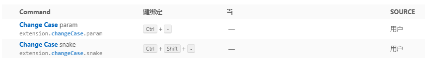

# vscode使用心得

- pubdate:2019-08-03 10:15:28
- tags :vscode,心得,index

------

## 快捷键

### 选区

拓展性 (Shift + Alt + Right) 或者收缩性 (Shift + Alt + Left) 的选中文本

矩形框的鼠标选择: 同时按住Shit和Alt并使用鼠标进行拖拽选择

### 折叠与展开

折叠当前光标所在区域: Ctrl + Shift + [
取消当前光标所在区域的折叠: Ctrl + Shift + ]
折叠当前文件内容的所有区域: Ctrl + K Ctrl + 0

### 搜索

在Ctrl+P窗口下还可以

直接输入文件名，跳转到文件
? 列出当前可执行的动作
! 显示Errors或Warnings，也可以`Ctrl+Shift+M
: 跳转到行数，也可以Ctrl+G直接进入
@ 跳转到symbol（搜索变量或者函数），也可以Ctrl+Shift+O直接进入
@:根据分类跳转symbol，查找属性或函数，也可以Ctrl+Shift+O后输入:进入

## 插件

1. [change case](https://marketplace.visualstudio.com/items?itemName=wmaurer.change-case)
    这个插件可以执行各种命名规则
    我配置了这两个快捷键 

2. [alt+d跳转](https://marketplace.visualstudio.com/items?itemName=jack89ita.open-file-from-path)
    vscode 在一些文件中 ctrl+click 并不能跳转一些路径，通过这个插件可以使用alt+d跳转
