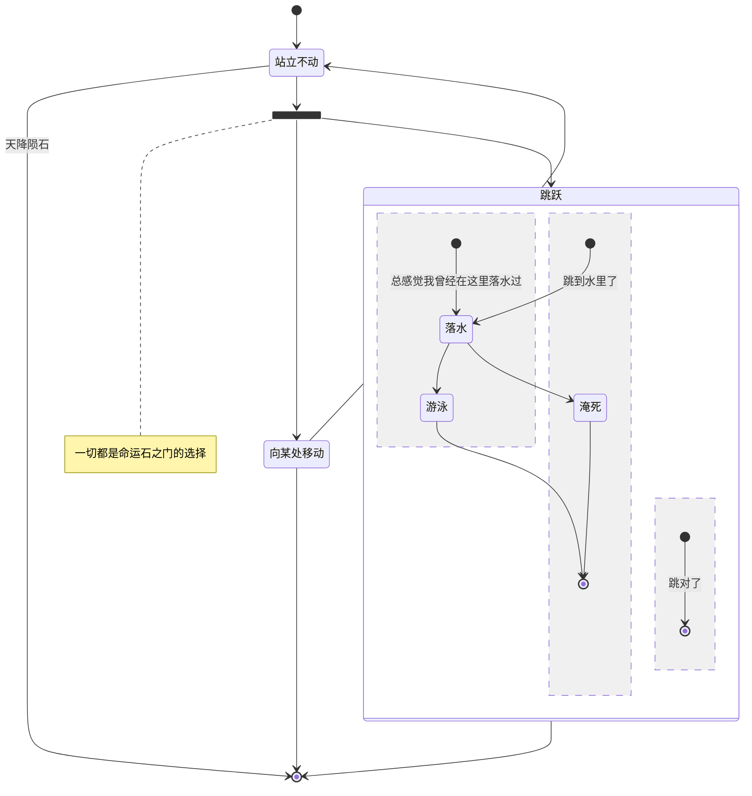
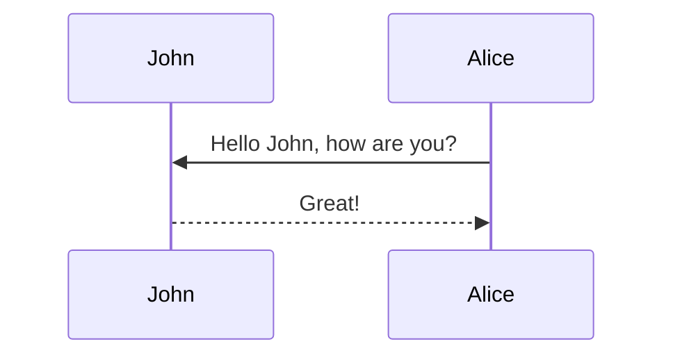

# markdown 学习
{: id="20201104153400-lit73mb"}

- {: id="20201104153400-guv03kk"}pubdate: 2019-3-6 17:43
- {: id="20201104153400-h70ehz6"}tags: markdown
{: id="20201104153400-bamy2pm"}

---

[[toc]]
{: id="20201104153400-3g4med8"}

## [Markdown：语法](https://daringfireball.net/projects/markdown/syntax#philosophy)
{: id="20201104153400-15q2ceq"}

### ###->h3
{: id="20201104153400-97dco18"}

#### ####->h4
{: id="20201104153400-5uibpl0"}

##### #####->h5
{: id="20201104153400-rhsm1v9"}

```html{run}
<table>
  <tr>
    <td>markdown中也是可以使用html标签的.</td>
  </tr>
</table>
```
{: id="20201104153400-rub4h0a"}

> 引用
> {: id="20201104153400-zk2pqf1"}
>
>> 嵌套引用
>> {: id="20201104153400-k73onk4"}
>>
>>> 三层
>>> {: id="20201104153400-qm4o113"}
>>>
>>>> 四层
>>>> {: id="20201104153400-z0ihiwr"}
>>>>
>>>>> 五层
>>>>> {: id="20201104153400-blr2c0g"}
>>>>>
>>>> {: id="20201104153400-o2pfwlb"}
>>>>
>>> {: id="20201104153400-m7a24ui"}
>>>
>> {: id="20201104153400-3o58fqj"}
>>
> {: id="20201104153400-qn56888"}
{: id="20201104153400-znu87v9"}

### 列表
{: id="20201104153400-axh5cwq"}

1. {: id="20201104153400-j4w0kyb"}Red
2. {: id="20201104153400-cmgnqzd"}Green
3. {: id="20201104153400-07k6a2s"}Blue
{: id="20201104153400-0cfcvb4"}

```html
* Red * Green * Blue
```
{: id="20201104153400-aoub1f7"}

## 绘图
{: id="20201104153400-cfy25aj"}

[怎么使用代码画图](https://github.com/mermaid-js/mermaid)
{: id="20201104153400-9z81d68"}

### 状态图
{: id="20201104153400-qy8cfki"}


{: id="20201104153400-sec1fp1"}

### 顺序图
{: id="20201104153400-3owtez0"}


{: id="20201104153400-bv9n7pu"}

{: id="20201104153436-mnd0x5c"}

((20201104153400-3owtez0 "顺序图"))
{: id="20201104153437-sn7vxrw"}
