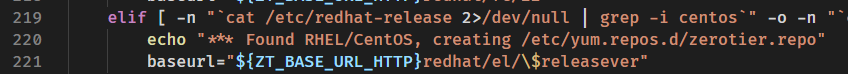

## 分析
{: id="20210505155206-ajlid62" updated="20210505155209"}

主要错误是 `http://download.zerotier.com/redhat/el/17.01/repodata/repomd.xml: [Errno 14] HTTP Error 404 - Not Found` ((20210505154759-540e2ii "{{.text}}"))
{: id="20210505154928-4tmahzn" updated="20210505155206"}

通过查看 [http://download.zerotier.com/redhat/el/](http://download.zerotier.com/redhat/el/) 可知应该是 `curl -s https://install.zerotier.com | sudo bash` 命令内依赖了系统版本这个数据，但由于我使用的是 Aliyun Linux 17.1 所以他找不到相关的信息
{: id="20210505155020-ai67wj2" updated="20210505155345"}

## 解决
{: id="20210505155153-q1codxb" updated="20210505155213"}

手动下载 [https://install.zerotier.com](https://install.zerotier.com) 这里的脚本，
{: id="20210505155213-8tljdzm" updated="20210505155227"}


{: id="20210505155347-mizdx7m"}

这里有一个 `$releaserver` 基本验证了 ((20210505155020-ai67wj2 "这里的推测"))
{: id="20210505154920-qope8vf" updated="20210505155438"}

我改成下图这样后再手动执行脚本安装成功了
{: id="20210505155459-ptpajb6" updated="20210505155521"}


{: id="20210505155441-bj32bpn" updated="20210505155456"}

## 具体报错信息
{: id="20210505154759-540e2ii" updated="20210505154925"}

curl -s https://install.zerotier.com | sudo bash
{: id="20210505154906-ts25cfg" updated="20210505154910"}

*** ZeroTier One Quick Install for Unix-like Systems
{: id="20210505154904-s7tlcf7" updated="20210505154906"}

*** Tested distributions and architectures:
***   MacOS (10.7+) on x86_64 (just installs ZeroTier One.pkg)
***   Debian (7+) on x86_64, x86, arm, and arm64
***   RedHat/CentOS (6+) on x86_64 and x86
***   Fedora (16+) on x86_64 and x86
***   SuSE (12+) on x86_64 and x86
***   Mint (18+) on x86_64, x86, arm, and arm64
{: id="20210505154904-vrrz10f"}

*** Please report problems to contact@zerotier.com and we will try to fix.
{: id="20210505154904-hgjp95p"}

*** Detecting Linux Distribution
{: id="20210505154904-dnlp2ns"}

*** Found RHEL/CentOS, creating /etc/yum.repos.d/zerotier.repo
{: id="20210505154904-snyg9gr"}

*** Installing zerotier-one package...
已加载插件：fastestmirror, langpacks
Repository base is listed more than once in the configuration
Repository updates is listed more than once in the configuration
Repository extras is listed more than once in the configuration
Repository base is listed more than once in the configuration
Repository updates is listed more than once in the configuration
Repository extras is listed more than once in the configuration
base                                                                                 | 3.1 kB  00:00:00
docker-ce-stable                                                                     | 3.5 kB  00:00:00
epel                                                                                 | 4.7 kB  00:00:00
extras                                                                               | 2.5 kB  00:00:00
mongodb-org-3.4                                                                      | 2.5 kB  00:00:00
mysql-connectors-community                                                           | 2.6 kB  00:00:00
mysql-tools-community                                                                | 2.6 kB  00:00:00
mysql57-community                                                                    | 2.6 kB  00:00:00
updates                                                                              | 2.5 kB  00:00:00
{: id="20210505154904-h3c7889"}

http://download.zerotier.com/redhat/el/17.01/repodata/repomd.xml: [Errno 14] HTTP Error 404 - Not Found
正在尝试其它镜像。
To address this issue please refer to the below knowledge base article
{: id="20210505154937-sgaxsqj" updated="20210505154954"}

https://access.redhat.com/articles/1320623
{: id="20210505154904-fpdsuml"}

If above article doesn't help to resolve this issue please create a bug on https://www.aliyun.com/
{: id="20210505154904-s4ikmss"}

One of the configured repositories failed (ZeroTier, Inc. RPM Release Repository),
and yum doesn't have enough cached data to continue. At this point the only
safe thing yum can do is fail. There are a few ways to work "fix" this:
{: id="20210505154904-pt0j37y"}

```
 1. Contact the upstream for the repository and get them to fix the problem.

 2. Reconfigure the baseurl/etc. for the repository, to point to a working
    upstream. This is most often useful if you are using a newer
    distribution release than is supported by the repository (and the
    packages for the previous distribution release still work).

 3. Run the command with the repository temporarily disabled
        yum --disablerepo=zerotier ...

 4. Disable the repository permanently, so yum won't use it by default. Yum
    will then just ignore the repository until you permanently enable it
    again or use --enablerepo for temporary usage:

        yum-config-manager --disable zerotier
    or
        subscription-manager repos --disable=zerotier

 5. Configure the failing repository to be skipped, if it is unavailable.
    Note that yum will try to contact the repo. when it runs most commands,
    so will have to try and fail each time (and thus. yum will be be much
    slower). If it is a very temporary problem though, this is often a nice
    compromise:

        yum-config-manager --save --setopt=zerotier.skip_if_unavailable=true
```
{: id="20210505154904-wwc2jwb"}

failure: repodata/repomd.xml from zerotier: [Errno 256] No more mirrors to try.
http://download.zerotier.com/redhat/el/17.01/repodata/repomd.xml: [Errno 14] HTTP Error 404 - Not Found
{: id="20210505154904-n2co8mw"}

*** Package installation failed! Unfortunately there may not be a package
*** for your architecture or distribution. For the source go to:
*** https://github.com/zerotier/ZeroTierOne
{: id="20210505154904-n6767yu"}


{: id="20210505154756-xqznmxz" type="doc"}
