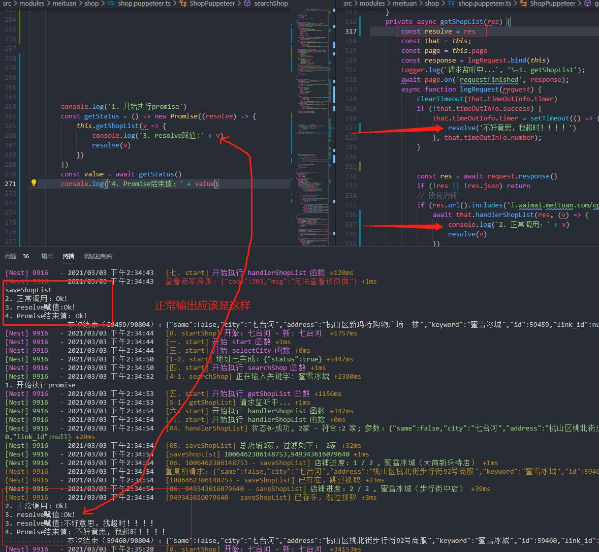
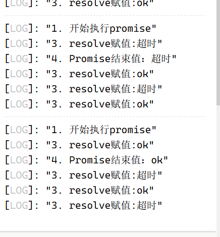
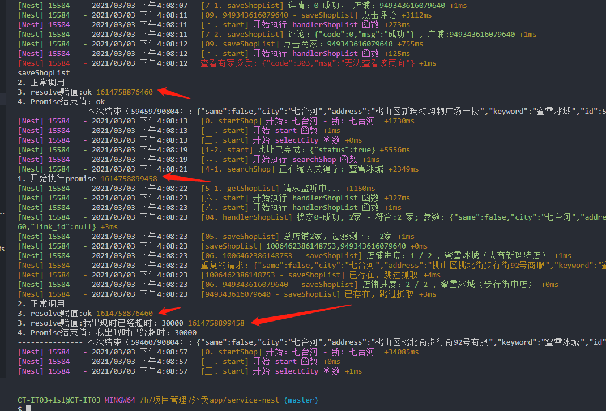

## 问题
{: id="20210303161511-k0pki4t" updated="20210303161517"}

{: id="20210303161517-trrdfio" updated="20210303161526"}

> 2021/3/3 遇到群友提出的一个问题
> {: id="20210303161532-jj57q1k" updated="20210303161541"}
{: id="20210303161526-c2nnotz" updated="20210303161532"}

{: id="20210303161513-phx2i5w" updated="20210303161513"}

我一开始以为很简单，但后来一想这个log不对，不管怎么样的流程都不会是这个输出
{: id="20210303161543-zg766zh" updated="20210303161622"}

## 聊天记录
{: id="20210303161622-opadcqb" updated="20210303162245"}

- {: id="20210303161730-nkz5mgg"}崮生    (见我吹水请禁言  15:37:56
  {: id="20210303161733-yhgqdir"}

  - {: id="20210303161733-q8xcprj"}[ts playground 模拟代码](https://www.typescriptlang.org/zh/play?noImplicitAny=false&module=0&useJavaScript=true#code/BQQwzgngdgxgBMAlHAvAPjgbwLACg4FwwD2UYxANgKYB0FxA5sAOQCMNcgAPqDTmoOZGgMhEAHAE7EAtgEswVZojyEipMABc4DKsoDKykMoCuYVAmTo4UKgHc4ABVGTpoSLATCq5CgDcqJjDnwLCEAsQCVV1LQALYkEAGSllYA9UX3kAtJIySlp6JmYAZg5Xdy9AaVjAHgUALmY4AGo4Dzl-NIUiyi9Exua4AF9Owl7UggyVepAKPSojIJCwjW1dAyRBxUzqOkYWABYOW3EpKkBlv0B9czLALH-quo8xicbepdw8R9xwaHgAMz1YZQlSNTmo2LxYCtTzeLBPBQ5ABKVAAjhMVPcFNJlAAVCRiKjEPQJJDJcFNALQuEIhJ9AjdAA0cFYAAZaY1li9nB8vj8oHBifC3GSCV0JG8EKxkH4usiNOjMdjcT4+WK0iD2gAiQChsYA30yV5LFVJp9MQAG5lgpuhDmgKhSKjc1pqEzJYbHZ9sA8aZRfKAijJVicc7ZW73c1FVRgEriABrTVW+U6gCsDKjAQGhONyxND1w3SAA)
    {: id="20210303161733-czy654e" updated="20210303162454"}
  - {: id="20210303161744-9who4a6"}我这里模拟的你的代码执行流程得到的结果是没有问题的，
    {: id="20210303161744-ataqaqr" updated="20210303161744"}
  {: id="20210303161730-x0bl31h" updated="20210303161733"}
{: id="20210303161709-fkgz76x" updated="20210303161730"}

- {: id="20210303161749-55ej632"}老司机带带我，我  15:39:22
  {: id="20210303161749-n2trgy4" updated="20210303161757"}

  - {: id="20210303161757-28ygu3p"}第一次是没问题， 第二次就不行了
    {: id="20210303161757-1xitas7" updated="20210303161757"}
  - {: id="20210303161759-ndk8d77"}((20210303161513-phx2i5w "{{.text}}"))
    {: id="20210303161759-6fyt835"}
  - {: id="20210303161852-usbnam1"}遍历执行第二次时。
    {: id="20210303161852-r307x9v" updated="20210303161857"}
  {: id="20210303161758-oyvjrif"}
{: id="20210303161709-ire97ok" updated="20210303161852"}

- {: id="20210303161901-fwqgbxo"}崮生    (见我吹水请禁言  15:40:28
  {: id="20210303161901-fd0hnei" updated="20210303161906"}

  - {: id="20210303161907-lyrye0t"}
    ，你那里连续打印两次赋值然后再打印的结束 很奇怪
    {: id="20210303161907-rwapale" updated="20210303161935"}
  - {: id="20210303161936-naj42vw"}我这里模拟的流程怎么弄也不可能连续两次赋值然后才结束
    {: id="20210303161936-hidfapa" updated="20210303161936"}
  {: id="20210303161907-0fndyer"}
{: id="20210303161709-60tpgv3" updated="20210303161901"}

- {: id="20210303161958-w6u1n0m"}老司机带带我，我  15:42:01
  {: id="20210303161947-6todq9a" updated="20210303161957"}

  - {: id="20210303161947-wtmctq5"}按理说 Promise 得到resolve后 就往下执行， 但是我的 resolve 需要2次。
    {: id="20210303161958-twlyrze"}
  - {: id="20210303161954-k2ek1y2"}这次我可以了， 也不知道原因， 只能不了了之。
    {: id="20210303161954-4hnouan" updated="20210303161954"}
  {: id="20210303161955-fke4a6o"}
{: id="20210303161709-obdhdi0" updated="20210303161947"}

- {: id="20210303162007-s8gal9x"}崮生    (见我吹水请禁言  15:48:53
  {: id="20210303162007-5t0i061" updated="20210303162011"}
- {: id="20210303162011-ov76cex"}我有一种猜想能得到你这个结果
  {: id="20210303162011-00e23fk" updated="20210303162024"}
- {: id="20210303162025-vj2v0s4"}搞不明白你这奇怪的输出
  {: id="20210303162025-lhlwfin" updated="20210303162025"}
{: id="20210303161709-hfod9no" updated="20210303162007"}

老司机带带我，我  15:51:22
意思是我上次的定时器没清理掉》？
{: id="20210303161709-vstclg1"}

老司机带带我，我  15:51:43
应该不是， 因为我的定时器需要100秒才会触发
{: id="20210303161709-76sun3z"}

崮生    (见我吹水请禁言  15:51:44
有可能，你 getShopList 内的逻辑比较混乱
{: id="20210303161709-h536vw3"}

老司机带带我，我  15:52:30
已经显示
显示了ok
{: id="20210303161709-7fzr18f" updated="20210303162039"}

老司机带带我，我  15:52:41
然后第二次才显示了 超时。
{: id="20210303161709-i020drw"}

崮生    (见我吹水请禁言  15:52:56
不一定是定时器，你 getShopList  内的代码使用 await 可能会将一个 log延时到了第二次才打印
{: id="20210303161709-e1f13hp"}

崮生    (见我吹水请禁言  15:53:15
你拉长 searchShop 的调用时间试试
{: id="20210303161709-es0xunj"}

崮生    (见我吹水请禁言  15:55:26
就是让 searchShop  的每次调用间隔久一点，排除一下第一次调用的log混入第二次的可能
{: id="20210303161709-8h7x3g9"}

崮生    (见我吹水请禁言  15:56:25
或者你给每次调用加一个 id ，然后在log内输出id，看连续的log是不是同一次调用的
{: id="20210303161709-0euw5m3"}

老司机带带我，我  15:58:40
调用getShopList 时？
{: id="20210303161709-xpbfqnz"}

崮生    (见我吹水请禁言  15:58:57
searchshop
{: id="20210303161709-rdka3ff"}

老司机带带我，我  15:59:25
searchshop 只调用一次。
{: id="20210303161709-d7j5meg" updated="20210303162220"}

老司机带带我，我  16:08:43
好像是上一次的。
{: id="20210303161709-x3morob"}

老司机带带我，我  16:09:18

{: id="20210303161709-hnk2d7e" updated="20210303162227"}

老司机带带我，我  16:09:20
破案了
{: id="20210303161709-uqfplw2"}

崮生    (见我吹水请禁言  16:10:09
果然不是同一次的
{: id="20210303161709-sigcujq"}

崮生    (见我吹水请禁言  16:10:28
我想来想去只想到 log 被延时了
{: id="20210303161709-cra4b0i"}

崮生    (见我吹水请禁言  16:12:32
老司机带带我，我
searchshop 只调用一次。
你这句话害的我又想了好一会
{: id="20210303161709-j1kop8y"}

老司机带带我，我  16:12:52
额，我没理解对。
{: id="20210303161709-xjobzut"}

老司机带带我，我  16:13:21
上次循环的结果没清理干净。
{: id="20210303161709-dwfu0vg"}

崮生    (见我吹水请禁言  16:13:50
找到问题了就好，编程就怕编程玄学
{: id="20210303161709-5bbga64"}

崮生    (见我吹水请禁言  16:13:57
变成玄学
{: id="20210303161709-n0fnuhm"}

{: id="20210303161709-agab1pr"}

{: id="20210303161429-imqdv28" type="doc"}
