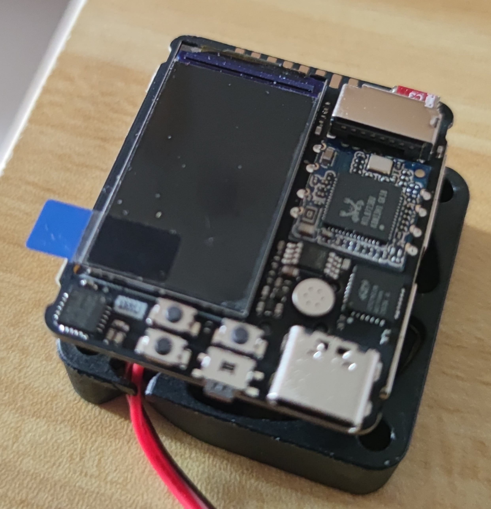
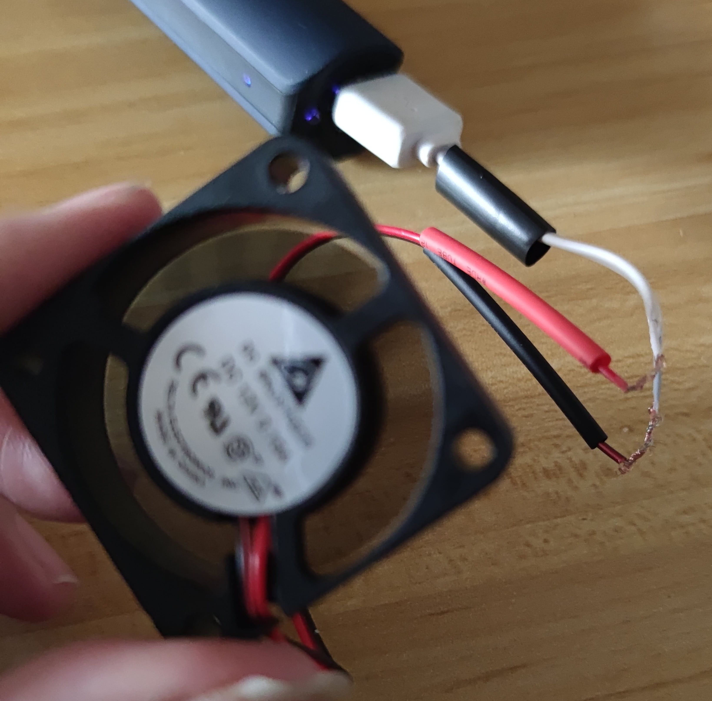

- {: id="20210115103824-mm9uoiv"}**时间线**
  - {: id="20210115103827-xpxmkjm"}2021/1/3 在 seeedstudio 下的单, 商品上写的 4月6号之前发货以为要等很久
  - {: id="20210115104001-fsjltrl"}2021/1/13 号就收到了，因为其他人退款就排到我了
    - {: id="20210115104042-zy8i2b0"}晚上尝试烧录系统，结果 sd 卡挂了，sd 卡用的乔安监控配发的，真的垃圾...
    - {: id="20210115104133-unnbhf9"}又下单了两张闪迪的，等待中....
    - {: id="20210116134937-6edtq4c"}因为发热的问题一并买了个 `4cm * 4cm * 1cm` 的小风扇
    {: id="20210115104051-atwlkz0"}
  - {: id="20210116134844-yn8jifd"}2021/1/16 风扇到手了，正好和开发板的体积差不多
    - {: id="20210116145829-b2vhdu8"} {: style="width: 350px;"}{: style="width: 350px;"}
    - {: id="20210116135109-d0u6mh6"}sd 卡淘宝显示今天到，但还没到海宁，难等 💔
      - {: id="20210116135241-b241bwr"}就在敲完上面那段话后淘宝提示到海宁了，惊喜啊
      {: id="20210116135243-xn37jus"}
    - {: id="20210116135515-mijpeo2"}风扇的电源线是 A1 插口的，我没有办法这样给他提供电，需要改成 usb 的
      - {: id="20210116135713-jzbboy5"}[usb 数据线接口定义](https://baike.baidu.com/item/USB%E6%95%B0%E6%8D%AE%E7%BA%BF) 待会拆一个 usb 线给风扇接上
      - {: id="20210116150229-9y0mbkw"}{: style="width: 350px;"}
      {: id="20210116135714-w76qbxk"}
    {: id="20210116135109-8aqw3bv"}
  {: id="20210115103828-1jjtfck"}
{: id="20210115103810-p651z39"}

## 资源
{: id="20210115104306-dqaznmc"}

[seeedstudio 提供的教程](https://wiki.seeedstudio.com/cn/Quantum-Mini-Linux-Development-Kit/#_11)
{: id="20210115104312-8mgs58s"}

[[同好写的文档] quark-n 的一些使用技巧](https://github.com/coolflyreg/quark-n)
{: id="20210115104330-m48tnyx"}

[稚晖君 github 超迷你模块化卡片电脑计划](https://github.com/peng-zhihui/Project-Quantum)
{: id="20210116134718-i9n4rcr"}

{: id="20210115103808-12zcrqu" type="doc"}
