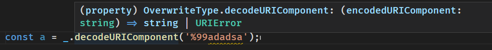

包装全局环境中的对象相关方法调用，从 throw 变成 return 并提供类型提示
{: id="20210410202627-nu4fw2p" updated="20210410202655"}

github repo：[ts_return_error](https://github.com/2234839/ts_return_error)
{: id="20210410202705-8278n5z" updated="20210410203634"}

## 你知道 js 中这些方法会 throw error 吗？
{: id="20210410202627-380a8qz" updated="20210410204254"}

```typescript

const a = decodeURIComponent('%99adadsa'); // 这里会 throw URIError

```
{: id="20210410202627-0z1iv7m"}

但我们在书写代码的时候，即便是在使用 typescript 的时候仍然无法知晓 `decodeURIComponent` 是不安全的，我们只有在阅读文档后才知道「噢，原来这里会报错啊」
{: id="20210410202627-fa8o5ao" updated="20210410202809"}

((20210410202607-9aupc9h "{{.text}}")) 这个项目的目的就是让我们在编写代码的时候就有意的去防范这些本来难以预知的行为
{: id="20210410202811-s1i0eda" updated="20210410202908"}


{: id="20210410202627-pg1tn7f" updated="20210410202958"}


{: id="20210410202959-ndkfmgh" updated="20210410203055"}

## 使用方法
{: id="20210410203750-9d6e6hs" updated="20210410203757"}

待完善。。。
{: id="20210410203757-1awztof" updated="20210410203807"}

```typescript
console.log(_.JSON.parse("{}")); // out: Object {  }
console.log(_.JSON.parse("77{}")); // out:SyntaxError: JSON.parse
console.log(_.decodeURIComponent("77{}")); // out:77{}
```
{: id="20210410203850-jr0q4dy" updated="20210410203853"}

## 亟需解决的问题
{: id="20210410204040-im323qw" updated="20210410204051"}

- {: id="20210410204120-lixhr28"}现在相关类型是我手动填写的，而且还只写了两个，要想办法让他自动生成才好
  {: id="20210410204120-8mxlhib"}
{: id="20210410204051-2hk0rz5" updated="20210410204120"}

## 扩展阅读
{: id="20210410203136-8ttyf3x" updated="20210410204040"}

- {: id="20210414101928-fc94rjo"}笔者提的关于先使用 @throws 提供一些提醒的建议 [Expect to use @throws in lib/*.d.ts to mark which methods may throw err · Issue #43528 · microsoft/TypeScript (github.com)](https://github.com/microsoft/TypeScript/issues/43528)
  {: id="20210414101928-699l5hi"}
{: id="20210410203403-dbbbfw0" updated="20210414101928"}

- {: id="20210414101930-z3nqfrw"}社区关于抛出错误类型的讨论 [Suggestion: `throws` clause and typed catch clause · Issue #13219 · microsoft/TypeScript (github.com)](https://github.com/microsoft/TypeScript/issues/13219)
  {: id="20210414101930-rbiqgf8"}
{: id="20210410203417-xy36ynt" updated="20210414101930"}

- {: id="20210414101935-nekn45b"}((20210303210010-949bprt "{{.text}}"))
  {: id="20210414101935-t2x3czw"}
{: id="20210410203444-642rqn1" updated="20210414101935"}

- {: id="20210414101939-1bz4jhs"}((20210411105659-pcgjcao "{{.text}}"))
  {: id="20210414101939-6s8908f"}
{: id="20210410203646-kgd2fe5" updated="20210414101939"}

{: id="20210414101923-q0gtaba"}


{: id="20210410202607-9aupc9h" type="doc"}
