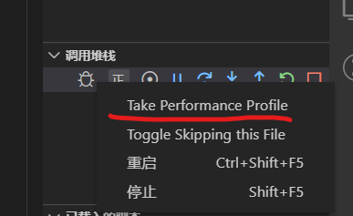
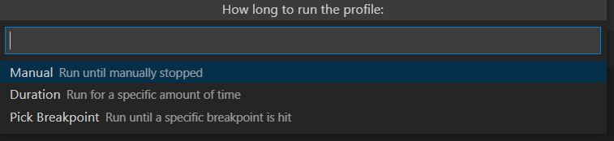
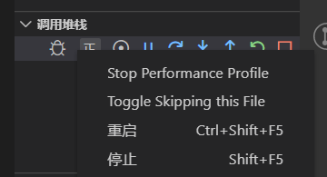
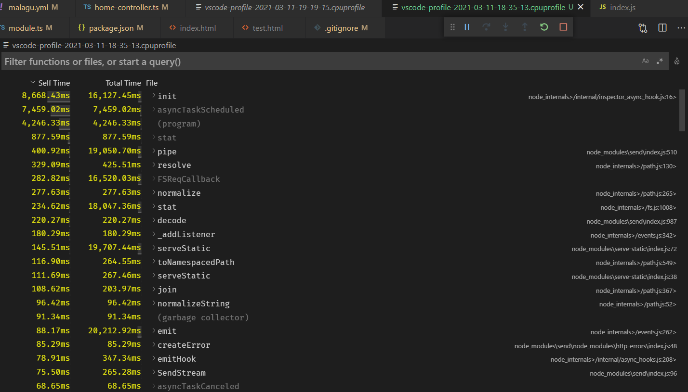

# vscode 调试定位 node.js 项目死循环代码
{: id="20210311191533-6gq3xfi" updated="20210311191542"}

按 f5 进入调试模式
{: id="20210311191628-449xsct" updated="20210311191636"}

在调试选项卡中的调试堆栈内的条目上右键可以发现有一个 `Take Performance Profile` 的选项 
{: id="20210311191637-pded2o9" updated="20210311191732"}

点击后又有三种模式可选择 
{: id="20210311191742-n4vq0ew" updated="20210311191813"}

我们选第一种，然后去复现触发死循环的行为
{: id="20210311191817-dz8cnbi" updated="20210311191858"}

过一会后再Stop
{: id="20210311191859-fcon7ix" updated="20210311191938"}

此时vscode会生成并打开这样的一个文件
{: id="20210311191939-1yquojk" updated="20210311192031"}

哪个函数在耗时一目了然，并且可以直接跳转到相关的代码处
{: id="20210311192034-rxejh4w" updated="20210311192149"}

vscode 强无敌✔ !
{: id="20210311192151-2xrj533" updated="20210311192245"}

{: id="20210311192209-iflh0bo"}

{: id="20210311191530-v6y7ex5" type="doc"}
