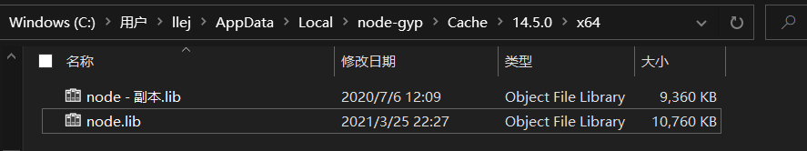

> 起源： ((20210325154235-xo42dww "{{.text}}"))
> {: id="20210326102601-vy4dhg1" updated="20210326102623"}
{: id="20210326102508-w823rbb" updated="20210326102601"}

## 日程
{: id="20210326221747-bawluvr" updated="20210326221751"}

1. {: id="20210326221823-omrfi8d"}2021/3/24 : 提出((20210325154235-xo42dww "{{.text}}"))
   {: id="20210326221823-iuwg0fn" updated="20210326221901"}
2. {: id="20210326221824-18dm1pk"}2021/3/25 : 完善想法、决定实施 ((20210326102459-nrdlzel "{{.text}}"))
   {: id="20210326221824-mu7h9zd" updated="20210326221919"}

   1. {: id="20210326221928-r59ucty"}[✨feat(input-hook): N-API hello word](https://github.com/2234839/quote/commit/b5b4eca2a97a05430194e013d6b6073dec3f1396)
      {: id="20210326221928-51xcbt2" updated="20210326221928"}
   {: id="20210326221929-929baq5"}
3. {: id="20210326222528-9ndmzh6"}2021/3/26 : 在搜索引擎上泡了一天，取得了不理想的进展
   {: id="20210326222527-hue9jc6" updated="20210326222726"}

   1. {: id="20210326222617-ocoha3l"}[✨feat(input-hook): 获取部分应用的插入符位置成功](https://github.com/2234839/quote/commit/3bd2640aa4a8e82a9f17e0f0b4972959461b63f2)
      {: id="20210326222617-s8f8eka"}
   2. {: id="20210326222711-hy688n8"}也许需要考虑在最差的情况下降级到监听触发后弹出输入框让用户在该 app 内输入选择然后再填充到原来的应用
      {: id="20210326222711-dr4b74q" updated="20210326222711"}
   3. {: id="20210326222729-i5x8obm"}明天打算先实现 ((20210326222711-hy688n8 "{{.text}}")) ，至于本来设想的直接在原生输入框内输入文本就能有提示的想法先搁置吧，对 win32 太不熟了，这玩意实现起来会很脏很花时间，以后再说
      {: id="20210326222729-nhoypcj" updated="20210326223019"}
   {: id="20210326222618-vqr0dl7"}
4. {: id="20210327093056-g380qo0"}2021/3/27 :
   {: id="20210327093055-sqgdze3" updated="20210327203707"}

   1. {: id="20210327093102-m07xdjz"}((20210327093006-7676fcr "{{.text}}"))
      {: id="20210327093102-ddrz0ct" updated="20210327093108"}
   2. {: id="20210327203555-c778bd8"}[✨feat(app): 实现简单的界面，接入思源搜索api](https://github.com/2234839/quote/commit/7cb756b071480b9d78062b8f1362a7d35d94bc0f)
      {: id="20210327203555-u44rh9e" updated="20210327203555"}
   3. {: id="20210327203602-yxd1gig"}[✨feat(app): 引入 robotjs 初步完成切换到之前的应用程序与粘贴功能](https://github.com/2234839/quote/commit/e5ddef779254f60a6bd6e75da925d8201e778885)
      {: id="20210327203602-2w7wq9a" updated="20210327203602"}
   4. {: id="20210327203615-8esak7d"}[✨feat(app): 通过模拟按键来读取当前输入内容](https://github.com/2234839/quote/commit/26575b8abb74bf3d4a58d0a144a8808f5659dc44)
      {: id="20210327203615-jqoswly" updated="20210327203615"}

      1. {: id="20210327203626-dceujdr"}或许要考虑使用快捷键来主动触发查询了，直接获取用户输入目前没有想到一个可行的方案
         {: id="20210327203626-hr1odlr" updated="20210327203853"}
      {: id="20210327203627-v4fpngy"}
   {: id="20210327093103-zh6sz3u"}
{: id="20210326221751-ksbro0k" updated="20210327203633"}

{: id="20210326221818-xaz1gmw"}

## 实现思路
{: id="20210325155044-2y0lnwv" updated="20210326221747"}

- {: id="20210325202632-kdeakxo"}监听用户按键
  {: id="20210325202632-8cxirg3" updated="20210325202639"}

  - {: id="20210325212640-hmuiw91"}[iohook 这个库可以监听按键](https://wilix-team.github.io/iohook/os-support.html)
    {: id="20210325212640-0w6jt65" updated="20210325212702"}
  - {: id="20210326102634-fbtfnmt"}c++ 通过 win32 api 监听，N-API 包装
    {: id="20210326102634-z80lkim" updated="20210326102654"}
  {: id="20210325212640-zl768s4"}
- {: id="20210325202641-ww360ls"}读取输入框内容，从后向前获取一定长度文本
  {: id="20210325202641-7qfge3q" updated="20210325202744"}

  - {: id="20210326150644-pbohk4c"}这一步的难度比想象的大
    {: id="20210326150644-dekfwey" updated="20210326150654"}

    - {: id="20210326150654-ysyjpoh"}或许可以参照输入法的实现
      {: id="20210326150654-6m5b00i" updated="20210326150702"}

      - {: id="20210326151824-xz5z959"}输入法是怎么知道输入框的位置的？
        {: id="20210326151824-st2ndu9" updated="20210326151835"}
      - {: id="20210326152450-zng4h2u"}[在 stackoverflow 求助网友](https://stackoverflow.com/questions/66812570/how-can-i-get-the-location-and-content-of-the-input-box-i-am-typing-in-under-win)
        {: id="20210326152450-m4mmh8e" updated="20210326152524"}
      {: id="20210326151824-vn99qge"}
    {: id="20210326150655-9mmuw3u"}
  - {: id="20210326180029-raszsoj"}获取插入符（就是一闪一闪的那个光标）位置
    {: id="20210326153215-jvtt8z1" updated="20210326153303"}

    - {: id="20210326153217-p2rrgse"}[GetCaretPos function (winuser.h) - Win32 apps | Microsoft Docs](https://docs.microsoft.com/zh-cn/windows/win32/api/winuser/nf-winuser-getcaretpos?redirectedfrom=MSDN)
      {: id="20210326180029-kuxhzxt"}

      - {: id="20210326180032-dl42adp"}这个好像只能在自己的窗口内使用
        {: id="20210326180032-8yyz8pv" updated="20210326180043"}
      {: id="20210326180032-frmmhy0"}
    - {: id="20210326170601-624e4xo"}使用 [GetGUIThreadInfo](https://docs.microsoft.com/en-us/windows/win32/api/winuser/nf-winuser-getguithreadinfo)
      {: id="20210326170601-tn9f5p3" updated="20210326180443"}

      - {: id="20210326180446-cinu8ie"}一个成功获取插入符坐标的实例 [https://bbs.pediy.com/thread-61157.htm](https://bbs.pediy.com/thread-61157.htm)
        {: id="20210326180446-vakvpfq" updated="20210326180446"}
      - {: id="20210326180448-mb8a6wx"}[这里有一份更精简的代码](https://social.msdn.microsoft.com/Forums/vstudio/en-US/fe948416-9c28-419e-8bf1-0b3a78a45e46?forum=visualcpluszhchs)
        {: id="20210326180448-1plexsr" updated="20210326180549"}
      - {: id="20210326215917-89mh8oo"}这个 api 对于自绘光标的应用不行，不够完美
        {: id="20210326215917-od5qxxu" updated="20210326222707"}

        - {: id="20210326221131-wdmw7c6"}不行： chromium 内核全不行、qq
          {: id="20210326221131-ohw00ap" updated="20210326223052"}
        - {: id="20210326221200-clfuk2h"}可行：钉钉、微信、Firefox
          {: id="20210326221200-yhqfynb" updated="20210326221224"}
        {: id="20210326221131-mbe9hy2"}
      {: id="20210326180447-ao0knmm"}
    {: id="20210326170601-igq0y1k"}
  {: id="20210326150644-8xnbiu4"}
- {: id="20210325202745-s5t2qxz"}判断文本是否符合模式`[[text`
  {: id="20210325202745-acxtzsi" updated="20210325202806"}
- {: id="20210325202807-kd6l0hn"}通过 api 检索 text ，显示列表
  {: id="20210325202807-vrntzvn" updated="20210325202833"}
- {: id="20210325202834-nmy7f9l"}移动列表到离输入框合适的地方
  {: id="20210325202834-7ugebus" updated="20210325202852"}
- {: id="20210325202901-g4luqja"}用户选择项目后通过 粘贴 来将文本填进去
  {: id="20210325202901-vreed6k" updated="20210325202926"}
{: id="20210325202629-yef3pqm" updated="20210326221137"}

### 采坑记录
{: id="20210325222819-2mcycpz" updated="20210325222826"}

- {: id="20210325224310-aly3yav"}[vscode 无法找到 node_api.h](https://stackoverflow.com/questions/61730307/node-js-native-addons-where-is-node-api-h-located)
  {: id="20210325224310-ix7lykw" updated="20210325224425"}
{: id="20210325224309-x7uy92g" updated="20210325224425"}

- {: id="20210325222827-mabk9in"}打算使用 N-API 的方式来将用户按键以及当前焦点框传给其他程序
  {: id="20210325222827-a19n71a" updated="20210325222857"}

  - {: id="20210325222857-df0h4b6"}在走一个 N-API 的 [hello word 程序](https://www.jianshu.com/p/6b0d60672e04)的时候报错 `C:\\Users\\llej\\AppData\\Local\\node-gyp\\Cache\\14.5.0\\x64\\node.lib : fatal error LNK1127: 库已损坏 [D:\code\quote\packages\i`
    {: id="20210325222857-4ngu2hh" updated="20210325223448"}
  - {: id="20210325222951-t15ofra"}搜索了一下发现可能是 node.lib 不对劲，于是去 https://nodejs.org/download/release/v14.5.0/win-x64/ 这里下载对应版本的 node.lib
    {: id="20210325222951-s1k0cy2" updated="20210325223035"}

    - {: id="20210325223037-fzbwwga"}浏览器直接打开了新标签....
      {: id="20210325223037-2z2cpwn" updated="20210325223050"}
    - {: id="20210325223053-f4o1k6m"}F12 修改 a 标签给他加上 download 属性
      {: id="20210325223053-cid0yby" updated="20210325223128"}
    {: id="20210325223037-93e6ykg"}
  - {: id="20210325223131-c8fe3xp"}下载后替换成功编译
    {: id="20210325223129-q90trbx" updated="20210325223138"}
  - {: id="20210325223158-vlcqss4"}
    {: id="20210325223158-x0jqdb9" updated="20210326102528"}
  {: id="20210325222858-b5uslmx"}
- {: id="20210327083040-6z4v78n"}electron 在使用 yarn workspace 的时候需要配置将 electron 就放在该包下面，而不是集中起来，因为他编译的时候会读取 node_modules 中 electron 的内容
  {: id="20210327083039-f9j6cny" updated="20210327083207"}

  - {: id="20210327083207-twhv76h"}[https://github.com/electron-userland/electron-builder/issues/3984#issuecomment-784524894](https://github.com/electron-userland/electron-builder/issues/3984#issuecomment-784524894)
    {: id="20210327083207-hnk1gad" updated="20210327083308"}

    - {: id="20210327083316-mh7yl94"}
      ```
      "workspaces": {
          "nohoist": [
            "electron"
          ]
        }
      ```
      {: id="20210327083316-k0prizg" updated="20210327083318"}
    - {: id="20210327090042-vh3z8cq"}[❤ Yarn workspace `nohoist` option does not seem to work as documentation states... · Issue #6412 · yarnpkg/yarn · GitHub](https://github.com/yarnpkg/yarn/issues/6412)
      {: id="20210327090041-oeutkp0" updated="20210327093001"}
    - {: id="20210327093006-srexq5b"}解决方案： [✨feat(app): fix electron build error](https://github.com/2234839/quote/commit/6f650e4c23f4a176cc6b13e423678b39fd1dc1a0)
      {: id="20210327093006-7676fcr" updated="20210327093046"}
    {: id="20210327083317-atf9p45"}
  {: id="20210327083207-99re5a4"}
- {: id="20210327174548-t1rug2r"}使用 rebotjs 得到报错： NODE_MODULE_VERSION 83. This version of Node.js requires
  [CONSOLE] NODE_MODULE_VERSION 85. Please try re-compiling or re-installing
  [CONSOLE] the module (for instance, using `npm rebuild` or `npm install`).
  {: id="20210327174547-n4cg7xi" updated="20210327174707"}

  - {: id="20210327174708-20bqqip"}是 electron 需要 rebuild，执行 `.\node_modules\.bin\electron-builder` 后就行了
    {: id="20210327174814-n0uxjbo" updated="20210327174914"}
  {: id="20210327174818-ou34myq"}
{: id="20210325222826-bndkjsm" updated="20210327174909"}

{: id="20210326164836-e4eebzr" updated="20210327133953"}


{: id="20210326102459-nrdlzel" type="doc"}
