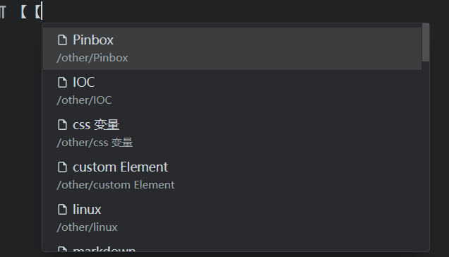

## 功能
{: id="20210325155354-beump17" updated="20210325155401"}

#想法# 或许可以使用类似于 AutoHotkey 这样的工具来监听输入 `[[`
然后弹出和在思源内部使用一样的列表
{: id="20210325154243-1anw3ci" updated="20210325155417"}

{: id="20210325154243-8dllnq9" updated="20210325155415"}

当用户选择后，在当前输入框填充入 [ html链接 | md格式链接 | 文本 ] 。
{: id="20210325154243-eegmj93"}

## 场景畅想
{: id="20210325154243-yx02rdk"}

- {: id="20210325154258-694udvx"}在聊天应用的输入框直接输入 【【 就可以搜索自己笔记本中的内容然后填充进去
  {: id="20210325154258-ym9n3bv" updated="20210325154347"}
{: id="20210325154243-ovwdam4" updated="20210325154258"}

## ((20210326102459-nrdlzel "{{.text}}"))
{: id="20210326102439-cq7dtvh" updated="20210326102547"}

## ((20210325155155-2wk7rxv "{{.text}}"))
{: id="20210410114258-cfs1oi0" updated="20210410114319"}

[https://ld246.com/article/1616658417483](https://ld246.com/article/1616658417483)
{: id="20210325155155-09h2p42" updated="20210410114357"}

{: id="20210410114338-f6p4mdx" updated="20210410114348"}

{: id="20210410114351-pwbb1rf"}

{: id="20210410114314-5b537dt"}

{: id="20210325154235-xo42dww" type="doc"}
