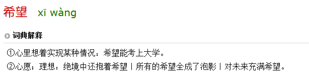

> # 序：[97 年，23 岁，一事无成，未来还有希望吗？](https://www.zhihu.com/question/376164372)[^1]
> {: id="20201226181837-zff41ze"}
{: id="20201226134911-x9asowm"}

看着问题我想了一下我的希望，突然发现我不知道希望是什么。
{: id="20201226135206-c4di17g"}

翻阅了一下字典：
{: id="20201226135250-cm03mi3"}

> 
> {: id="20201226135131-cksfw1d"}
{: id="20201226134958-ip95wdh"}

这里应该讲的是第二种：心愿、理想
{: id="20201226135102-9epvcpp"}

我问自己，「我的心愿是什么？我的理想是什么？」一时间有许多东西浮上心头。
{: id="20201226135549-0vgkgl1"}

例如：
{: id="20201226135956-w56x22p"}

- {: id="20201226140023-ef6cst3"}考清华北大
- {: id="20201226140438-a3pbjx9"}考上一本
- {: id="20201226140507-ic2z2rw"}考上二本
- {: id="20201226140512-qn1awtj"}找个好工作
- {: id="20201226140520-6v77yxy"}身体健康
- {: id="20201226140431-jzu3fw2"}......
{: id="20201226140014-f9qzrk9"}

随即心里又浮起一问：**这是你的吗？** 再思考，我一直在放弃，一直在失败...
{: id="20201226135825-ygxujzt"}

> ((20201226142014-wc7ga2h "{{.text}}"))
> {: id="20201226140946-7v5ri2e"}
{: id="20201226140921-wckjxxn"}

我还有希望吗？
{: id="20201226140934-j5vbuzl"}

心愿和理想是有的，虽然越来越卑微
{: id="20201226141043-xmshotn"}

我还有希望吗？
{: id="20201226141322-7ig4iln"}

大概....没有了吧。
{: id="20201226141334-2smi2o4"}

{: id="20201226143112-uymbdgf"}

{: id="20201226143113-wul5jdz"}

甘心吗？
{: id="20201226141435-c9xopzt"}

不甘心！
{: id="20201226141644-s2ndklp"}

{: id="20201226181153-fojsjc7"}

虽屡战屡败，将至死方休！
{: id="20201226141702-7ui96ry"}

{: id="20201226181810-cnmqfkx"}

[^1]: 97 年，23 岁，一事无成，未来还有希望吗？ - 崮生的回答 - 知乎
    https://www.zhihu.com/question/376164372/answer/1646476550
    {: id="20201226181804-e23lgfq"}

{: id="20201226181839-s25nmy9"}

{: id="20201226134721-9xsczq4" type="doc"}
