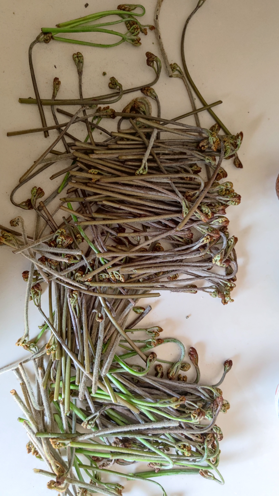

## 什么地方的蕨菜好
{: id="20210322144416-bj8p2y1" updated="20210322144826"}

半阴半阳之处最佳，((20210322144701-aae1wjb "{{.text}}")) 。
{: id="20210322144419-y4dzlyk" updated="20210322144729"}

阳处速生或已散枝，或矮矮不堪低腰折。
{: id="20210322143950-xcaifd7" updated="20210322144259"}

## 成果
{: id="20210322144300-1z4sspl" updated="20210322144303"}

{: id="20210322143550-wy0b1qw" updated="20210322144413"}

### 阴处绒毛多而茎硬
{: id="20210322144701-aae1wjb" updated="20210322144808"}

{: id="20210322144517-flevq8f" updated="20210322144640"}

{: id="20210322143546-fmh2888" type="doc"}
