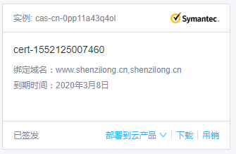

# node 使用koa搭建https网站

- pubdate: 2019-03-09 18:17:32
- tags : 服务器,https,网站建设,koa

---


看着这个标识有点碍眼于是决定搭建一个https的站点来练练手

## ssl证书

这个很容易，去阿里云申请一个免费的ssl证书



然后下载下来。
得到了一个key文件和一个pem文件。

## 创建https服务器

这一步也十分简单
读取key文件和pem文件构造出指定键名的对象
然后用https模块创建server 传入 options 和koa的处理函数

```javascript
const options = {
    key: fs.readFileSync(path.resolve(__dirname,config.sslDir.key)),
    cert: fs.readFileSync(path.resolve(__dirname,config.sslDir.pem))
};

http.createServer(app.callback()).listen(80);
https.createServer(options,app.callback()).listen(443);
```

就大功告成了。
