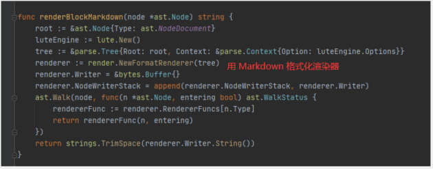

# ((20201105103725-dd01qas "思源笔记"))  其他记录
{: id="20201117200356-cz8yaiu"}

---

## ((20201105162504-ftm3r0p "我提的一些 issues"))  ((20201105103725-dd01qas "思源笔记"))
{: id="20201105161704-racjvte"}

* {: id="20201117200356-es4wodb"}[X] [BlockRef 没有触发自定义渲染器](https://github.com/88250/lute/issues/102)
* {: id="20201117200356-7xj82jw"}[X] [公式块 id 没有渲染，标题 「id」是否应该换一种处理方式？](https://github.com/88250/lute/issues/101)
* {: id="20201117200356-vsltuyk"}[X] [【渲染 bug】昨天更新的版本报错 Error: runtime error: slice bounds out of range](https://github.com/88250/lute/issues/100)
* {: id="20201117200356-oy9xktz"}[X] [标题块渲染为 html 后丢失块 id 信息](https://github.com/88250/lute/issues/99)
* {: id="20201117200356-cgi26rh"}[X] [使用 lute.MarkdownStr("", md_str) 得到的结果里面有 id 该怎么处理](https://github.com/88250/lute/issues/98)
{: id="20201117200356-llhjtm0"}

## 开发帮助
{: id="20201113171329-yrb7hfn"}

### Node 结构体渲染为 markdown
{: id="20201118002742-i5t9ds1"}

{: id="20201118002650-3e03vyq"}

{: id="20201118002738-x573ace"}

* {: id="20201118002807-rq1s9wd"}[ ] 我再尝试的时候遇到了一个问题，那就是我渲染出来的ID都是空不知道为什么
{: id="20201118002807-xdpmo3z" bookmark="TODO"}

pages/cart/goods-list/goods-list?title=羊绒&category_id=35
{: id="20201118002829-ufhhmqf"}

pages/cart/goods-list/goods-list?title=羊剪绒&category_id=2
{: id="20201118111042-b8m15ab"}

pages/cart/goods-list/goods-list?title=羽绒派克&category_id=34
{: id="20201118111048-ir4flzx"}

pages/cart/goods-list/goods-list?title=派克服&category_id=3
{: id="20201118111036-ctqqeru"}

pages/cart/goods-list/goods-list?title=羽绒服&category_id=33
{: id="20201118111058-xb5cozz"}

pages/cart/goods-list/goods-list?title=水貂&category_id=38
{: id="20201118111103-4m8lmyk"}
