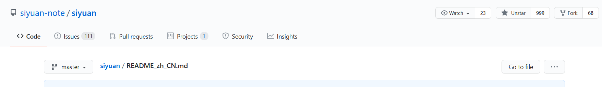

# 思源笔记
{: id="20201105103725-dd01qas"}

[思源代码库](https://github.com/siyuan-note/siyuan)
{: id="20201125120429-wccr64p"}

((20201121142422-1gk6qv5 "{{.text}} 思源生成静态站点"))
{: id="20210209130024-fggewdd"}

---

[关于思源笔记的 markdown 如何渲染](https://github.com/siyuan-note/siyuan/issues/418)
{: id="20201125120429-kph1c2j"}

## 如何自定义渲染器
{: id="20201125120429-p8ls74r"}

[JavaScript 重写渲染器的方法](https://github.com/88250/lute/issues/5)  [原版渲染器地址](https://github.com/88250/lute/blob/master/render/html_renderer.go)   [Markdown 解析原理详解和 Markdown AST 描述](https://ld246.com/article/1587637426085)
{: id="20201125120429-08b8ykm"}

在 parser/parser.go 中有描述一些渲染配置
{: id="20201125120429-5mfeymc"}

```javascript
lute.SetKramdownIAL(true); // 不将块id {: id="20201105110148-yqza4sm"} 渲染为文本
lute.SetKramdownIALIDRenderName("data-block-id"); // 将块 id 赋值给元素的data-block-id
```
{: id="20201125120429-bylt3e6"}

## 记录思源仓库 999 start （ 2021/2/9)
{: id="20210209124629-yract2b"}


{: id="20210209124658-zwds59g"}

## 以下是用来测试渲染效果的
{: id="20201125120429-rq6gnau"}

页面引用： ((20201105161628-4vktwyt "思源笔记 其他记录"))
{: id="20201125120429-gph7gp3"}

块引用：((20201105161704-racjvte "我提的一些 issues  思源笔记"))
{: id="20201125120429-1jptmeq"}

((20201108153931-8tyw4zw "{{.text}}"))
{: id="20201125120429-rv4atm1"}

下面是嵌入块引用
{: id="20201125120429-0wng1w1"}

!((20201105161704-racjvte "我提的一些 issues  思源笔记"))
{: id="20201125120429-96v7do3"}

下面是一行嵌入块
{: id="20201125120429-762p6xt"}

!((20201121142250-68i2qmv "BlockRef 没有触发自定义"))
{: id="20201125120429-vt8rhox"}

 $a^3$    你好 hello
{: id="20201125120429-16mryh8"}

$$
a^3
$$
{: id="20201125120429-bs1n28w"}

```javascript {run}
console.log(3333)
```
{: id="20201125120429-8c3ecc0"}

## 块 33321
{: id="20201108153931-8tyw4zw"}

((20201108153931-8tyw4zw "{{.text}}"))
{: id="20201210172614-ln43sq4"}

[相对路径测试](../blog)
{: id="20201125120429-f3dync7"}

{{{
超级块测试
{: id="20201125140645-gn17aas"}

## test
{: id="20210209125951-hlpghto"}

{: id="20210209125951-2nhovf1"}

{: id="20210209125951-wi9wltt"}

!((20201125152443-2qhvgr1 "{{.text}}"))
{: id="20210209125951-zq0fwjy"}

{: id="20210209125951-6b7fj40"}

}}}
{: id="20201125141217-41uqvwo"}

!((20201125141217-41uqvwo "超级块嵌入测试"))
{: id="20201125152443-2qhvgr1"}

东西都很奇怪[^test] 3[^1]
{: id="20201203150233-84hct14"}

((20201105162418-vn3ikh1 "{{.text}}"undefined))
{: id="20201210174027-gjy5j6a"}

**eeees**{: style="color: red"}
{: id="20201203150329-6dagt66"}

**高亮功能测试**{: style="background-image: linear-gradient(to right, var(--b3-theme-primary), var(--b3-theme-error)); -webkit-background-clip: text; color: transparent;"}，**背景高亮**{: style="background-color: rgb(41, 253, 46); color: var(--b3-theme-background);"}，**字**{: style="color: rgb(255, 253, 56);"}**体高亮**{: style="color: rgb(255, 253, 56);"}，**亮**亮**{: style="color: rgb(30, 177, 237);"}亮亮亮亮亮**{: style="background-color: rgb(255, 253, 56); color: rgb(252, 13, 27);"}亮
{: id="20210105213133-6v6wnn4"}

((20210105213133-6v6wnn4 "{{.text}}"))
{: id="20210105213956-skaq7b6"}

[^test]: 这个脚注好像有点意思
    {: id="20201203150356-taxv459"}


[^1]: 第一个脚注定义。
    {: id="20201203150313-xbl5cik"}


{: id="20210209130056-un8fgcy"}


{: id="20201104155455-awawq0n" type="doc"}
