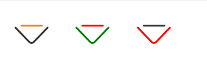
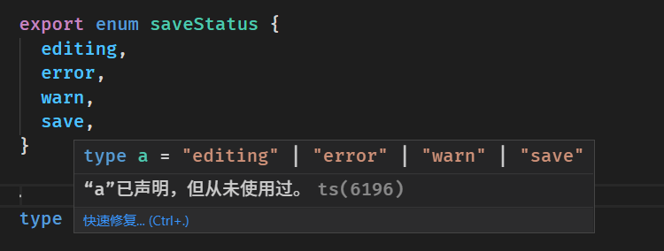
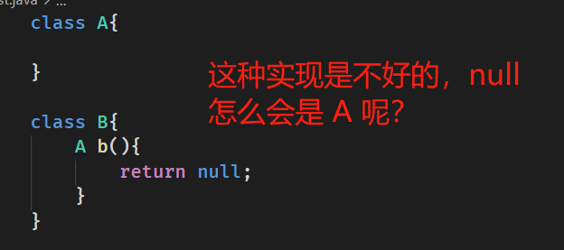
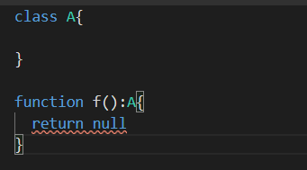

# 12 月的每日总结
{: id="20201201103016-97kh8cd"}

12 月了时间过的真快。....
{: id="20201201103047-ipkbhog"}

---

[JavaScript 语句后应该加分号么？ - 贺师俊的回答 - 知乎](https://www.zhihu.com/question/20298345/answer/14670020) 关于这个问题我一贯的倾向是我不会主动写不必要的分号，依靠格式化工具自动添加分号。我倾向于无分号派 (^ 人 ^) 。
{: id="20201201103205-8ym5wiv"}

> 不要奢望工具能解决人的问题
> {: id="20201201103348-4ba9dvx"}
{: id="20201201103333-hu4fu41"}

分号也是工具，一律添加不如不要。他应该要在合适的位置去解决歧义，而非漫天都是。
{: id="20201201103357-ek32ke5"}

---

## QQ 邮箱 #自动化脚本# 删除收信规则
{: id="20201201172239-qjncq95"}

之前因为一些原因在 QQ 邮箱中添加了很多的收信规则，现在想删除。但一个一个点实在太麻烦了，故写了如下脚本
{: id="20201201172548-91u95wz"}

```javascript
const qAll = (s) => top[1].document.querySelectorAll(s);

setInterval(() => {
  [...qAll(`[id*="ruleRc_"]`)]
    .filter((el) => el.textContent.includes("移动到 邮件归档"))[0]
    .querySelector(" div.col3 > a:nth-child(2)")
    .click();
  setTimeout(() => {
    document.querySelector("#QMconfirm_QMDialog_confirm").click();
  }, 100);
}, 1000);
```
{: id="20201201172359-es9ip4w"}

这个脚本很容易懂，也可以很容易的修改其中自定义的过滤规则来决定要删除什么样的收信规则
{: id="20201201172422-s6d9xh1"}

---

## 阿里 iconfont 多颜色设定尝试
{: id="20201202172447-h8sla4x"}

<iframe src="https://svelte.dev/repl/f5526b69512843b8b25f63ed4f5a49ab?version=3.30.1" width=700 height=400 ></iframe>

{: id="20201202172453-qcy348s"}

[demo 地址](https://svelte.dev/repl/f5526b69512843b8b25f63ed4f5a49ab?version=3.30.1)
{: id="20201202172507-dl4ube5"}


{: id="20201202172716-shcib3b"}

```html
<svg class="icon" aria-hidden="true">
    <use xlink:href="#icon-xiangxia"></use>
</svg>
<svg class="icon" aria-hidden="true" style="--c1:red;--c2:green">
    <use xlink:href="#icon-xiangxia"></use>
</svg>
<svg class="icon" aria-hidden="true" style="--c1:#333;--c2:red">
    <use xlink:href="#icon-xiangxia"></use>
</svg>
```
{: id="20201202172742-z7rd34y"}

经过一定的处理后可以通过((20201202172848-w21p8ky "CSS 变量"))来指定一个多色的 icon 其中一部分的颜色
{: id="20201202172808-9gvo3cq"}

---

## ((20201202223627-c71xiqq "tailwind CSS")) 的 ui 开发工具
{: id="20201202223601-myu1ak0"}

[UI Devtools for Tailwind CSS (ui-devtools.com)](https://ui-devtools.com/)
{: id="20201202223548-ka93rt2"}

---

## #react/router# 获取当前路由的 child (子路由) 选中的哪一个 route
{: id="20201204144054-y56w3kq"}

```typescript
const cur = route?.routes?.find((el) => matchPath(location.pathname, el))
```
{: id="20201204144146-3m7mqvd"}

## typescript enum 获取 key 的类型 type
{: id="20201209153952-kahknds"}


{: id="20201209154009-1vi3167"}

```typescript
export enum saveStatus {
  editing,
  error,
  warn,
  save,
}

type a = keyof typeof saveStatus
```
{: id="20201209154017-boknic8"}

## ts 枚举的零值导致的隐式转换问题
{: id="20201209154107-cdlanko"}

例如我们有上面 `saveStaus ` 这个枚举变量
{: id="20201209154135-2p3osiz"}

然后我们写出了如下代码
{: id="20201209154223-ulprwnx"}

```typescript
function test(s?: saveStatus) {
  if (s) {
      console.log(s, saveStatus.error)
  }
  console.log(s || saveStatus.error)
}
```
{: id="20201209154238-92ix4if"}

这里有两个错误，思考下
{: id="20201209154148-05u8ey3"}

1. {: id="20201209154833-kv1u69p"}if 的本意是想判断 s 有没有被传入，但当输入是这样的时候 `test(saveStatus.editing)` 就出现了问题，因为 enum 的性质 `saveStatus.editing` 的值是 `0` 这个 if 就没有符合我们的本意了。
   1. {: id="20201209155431-fs0agwk"}需要修正的话条件应该改成 `s !== undefined`
   {: id="20201209155432-gr08lxb"}
2. {: id="20201209155507-ov3ohex"}`console.log(s || saveStatus.error)` 的本意也是想在 `s` 没有被传入的时候有一个兜底的值，但和1的问题一样，`saveStatus.editing`的值是`0`导致他打印的是 `saveStatus.error` 而非预想的 s
{: id="20201209154831-nvd8xmu"}

这两个问题都是 `0` 的问题，而 `0` 来自于 `enum` 第一项是从零开始这个规定，所以我们想要优雅的解决这样问题的话最后的方案就是让他的第一项不是从零开始就行了
{: id="20201209155709-67ovbky"}

```typescript
enum saveStatus {
  editing = 1,
  error,
  warn,
  save,
}
```
{: id="20201209155917-v24mf5l"}

把这个 `saveStatus` 再代入上面的代码中就符合我们的预期了~ 🎉
{: id="20201209155852-jyi53pv"}

结论： **使用 enum 最好将第一项设置为 1**
{: id="20201209160032-st61uo4"}

---

## 错误的 null 设计
{: id="20201209223148-9rpztgo"}

在 Java 中 
{: id="20201209223138-wraci4v"}

ts 的实现是正确的，这里就是应该报错 
{: id="20201209223206-fbowh3m"}

> 在我看来 null 可以看做是所有对象的父类型，那么把 父类型赋值给 子类型就是显而易见的错误，不明白为什么有人维护 null 可以被赋值给 其他类型这个做法
> {: id="20201209224141-oi80w34"}
{: id="20201209224139-dg85b8o"}

---

## 「收藏吃灰！」的解决方案
{: id="20201210141155-imuexul"}

### 为什么 「收藏吃灰！」是不好的
{: id="20201210141207-j20g9xq"}

我们平时会将网站上看到的一些东西收藏起来，然后就去吃灰了，这里关键的原因就是我们没有一个良好的检索功能，因此有很多人使用各种笔记工具、剪藏功能，将这些内容放到笔记中，再利用笔记功能进行检索
{: id="20201210141226-v2wzjmy"}

但这里不得不思考的一点是：我们真的需要为价值不太确定（也许对我只有一点点价值）却不够紧要的知识专门做一篇笔记吗
{: id="20201210141406-nth31gj"}

我的思考的结论是：
{: id="20201210141520-h13gnpm"}

> 我们实际想要的可能仅仅是标记一下这块内容，然后在有需要的时候可以直接搜索到。
> {: id="20201210141627-fifvman"}
>
> 还有在网上再度浏览到这个知识点的时候能够提醒一下自己（诶！这个知识点我收藏过啊）甚至我曾经可能对于这个知识点做过笔记，这里最好应该能够复习一下这个笔记
> {: id="20201210141928-gxjys1n"}
{: id="20201210141625-vk4u5c9"}

重点在于 **标记**  后可以  **检索** 与 **再提醒** ，一般的收藏方案仅仅只是收藏，而 检索 与 再提醒 做的一塌糊涂，一般人谁会去翻那日积月累起来的收藏呢？这样收藏起来的东西又怎么摆脱吃灰的处境呢？
{: id="20201210142009-1iym522"}

### 那怎么办呢？
{: id="20201210141850-p04hvs4"}

我在明确了 ((20201210142009-1iym522 "重点在于 **标记**  后可以  **检索** 与 **再提醒**")) 这一点之后再去搜索对应的产品发现了 ((20201210142721-mwt2mnn "Pinbox"))
{: id="20201210141901-1t23b5p"}

!((20201210142748-g4wg414 "{{.title}}"))
{: id="20201210141606-comucbo"}

Pinbox 网站提供了 **检索** 的功能，在其他网站搜索的时候提供了一定的 **再提醒** 功能。
{: id="20201210143156-t9s00rr"}

这正好解决了我们的问题
{: id="20201210143416-5aj7v51"}

不过遗憾的是 Pinbox 本身的体验还存在一些问题
{: id="20201210143533-srdwh59"}

1. {: id="20201210143558-2l15rtm"}搜索功能只能在他的网页中使用，我更想要的是我可以随时随地的搜索自己标记过的内容
2. {: id="20201210143710-limueyv"}再提醒 功能实现的太弱了
   1. {: id="20201210143830-zpkd9ek"}只针对部分主流的搜索网站做了适配不够通用
   2. {: id="20201210143838-uw01fhi"}触发的场景不应该只在于用户主动搜索的时候，浏览的信息中显示有和被标记内容相关的信息的时候也应该 **再提醒**
   {: id="20201210143831-6gk2ioi"}
{: id="20201210143551-fhtlpd4"}

虽然他部分解决了我的问题，但综上所述，太弱了。
{: id="20201210143303-fmgoaqy"}

不过 Pinbox 貌似已经是这方面最强的产品了？（ 或许我了解的还不够
{: id="20201210144022-ug199ag"}

期待有更好的产品来解决这个问题  <(＿　＿)>
{: id="20201210144047-jc4ftbx"}

---

## 数据库异常数据监控思考
{: id="20201217144439-9phr7n4"}

刚碰到一个接口报错的问题，经排查是有一条数据不对劲
{: id="20201217144446-0vobdjc"}

于是我想是不是可以专门写一个检测异常数据的监控程序来检测是否出现了这种数据
{: id="20201217144514-b95en0n"}

目前的想法是定时执行一些 SQL 如果这些 SQL 的返回不符合预期则表明数据出现了问题，然后提醒开发人员及时的进行排查
{: id="20201217144607-4u3mf7q"}

例如某个表的某个字段按正常逻辑来说不会是 null 那就写一条 SQL 来统计这个字段为 null 的数据有多少条，超过 0 条的就发送报警信息
{: id="20201217145916-e57ekmj"}

像这样的 SQL 或许可以称之为 **数据库的测试用例** ？
{: id="20201217150318-x52uimh"}

---

[Mbrush 开源代码](https://github.com/2234839/mb)  Mbrush 是一个手持打印机
{: id="20201220202044-0ylltc2"}

---

今天对博客进行了一波修改，从使用 lute 对文章进行渲染改成了直接嵌入使用((20201121142422-1gk6qv5 "{{.text}}")) 生成的 HTML ，效果还行。
{: id="20201224202601-kc4r8hr"}

之后只要维护好 ((20201121142422-1gk6qv5 "{{.text}}")) 就行了，这样之后博客即可以随着((20201104155455-awawq0n "{{.text}}"))一起进步又可以通过实践来完善((20201121142422-1gk6qv5 "{{.text}}"))
{: id="20201224202739-4wmy5gj"}

## [图片压缩工具 Optimizilla](https://imagecompressor.com/zh/)
{: id="20201225160958-amryk25"}

他的压缩效果相当的好，((20201225101337-4ol4eml "{{.text}}")) 这个文章中的「眉眼」图原大小为 12M，压缩后只有 2.89M 而且对图片质量的损失我是基本看不出来的
{: id="20201225165403-zlv6hpv"}

## [确定什么是可拖拽的](https://developer.mozilla.org/zh-CN/docs/Web/API/HTML_Drag_and_Drop_API#确定什么是可拖拽的 "Permalink to 确定什么是可拖拽的")
{: id="20201226130832-q8vjybm"}

让一个元素被拖拽需要添加 [`draggable`](https://developer.mozilla.org/zh-CN/docs/Web/HTML/Global_attributes#attr-draggable)</a> 属性，再加上全局事件处理函数 [`ondragstart`](https://developer.mozilla.org/zh-CN/docs/Web/API/GlobalEventHandlers/ondragstart) ，
{: id="20201226130832-imgjf7m"}

如下面的示例代码所示：
{: id="20201226131300-pqc3l57"}

```
<script>
  function dragstart_handler(ev) {
    // Add the target element's id to the data transfer object
    ev.dataTransfer.setData("text/plain", ev.target.id);
  }

  window.addEventListener('DOMContentLoaded', () => {
    // Get the element by id
    const element = document.getElementById("p1");
    // Add the ondragstart event listener
    element.addEventListener("dragstart", dragstart_handler);
  });
</script>

<p id="p1" draggable="true">This element is draggable.</p>
```
{: id="20201226131300-x6sjybw"}

## [定义一个放置区](https://developer.mozilla.org/zh-CN/docs/Web/API/HTML_Drag_and_Drop_API#定义一个放置区 "Permalink to 定义一个放置区")
{: id="20201226131413-j3g32uf"}

当拖拽一个项目到 HTML 元素中时，浏览器默认不会有任何响应。想要让一个元素变成可释放区域，该元素必须设置 [`ondragover`](https://developer.mozilla.org/zh-CN/docs/Web/API/GlobalEventHandlers/ondragover) 和 [`ondrop`](https://developer.mozilla.org/zh-CN/docs/Web/API/GlobalEventHandlers/ondrop) 事件处理程序属性，下面的例子通过简单的事件处理展示了如何使用这些属性：
{: id="20201226131413-mezac3s"}

```
<script>
function dragover_handler(ev) {
 ev.preventDefault();
 ev.dataTransfer.dropEffect = "move";
}
function drop_handler(ev) {
 ev.preventDefault();
 // Get the id of the target and add the moved element to the target's DOM
 var data = ev.dataTransfer.getData("text/plain");
 ev.target.appendChild(document.getElementById(data));
}
</script>

<p id="target" ondrop="drop_handler(event)" ondragover="dragover_handler(event)">Drop Zone</p>
```
{: id="20201226131413-wg5jpxm"}

注意每个处理程序调用 [`preventDefault()`](https://developer.mozilla.org/zh-CN/docs/Web/API/Event/preventDefault) 来阻止对这个事件的其它处理过程（如触点事件或指针事件）。
{: id="20201226131413-9p0gm9c"}

{: id="20201226131413-ad33avf"}


{: id="20201201102932-3rahy0i" type="doc"}
