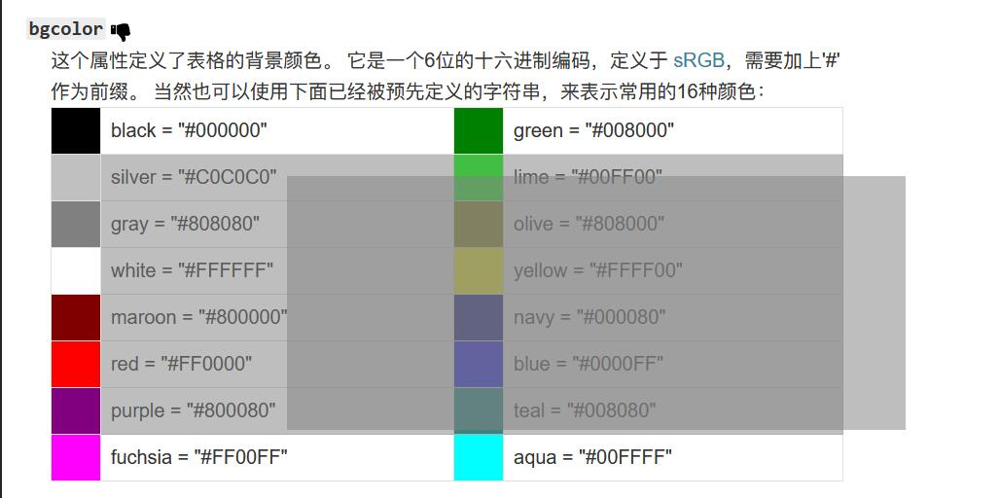
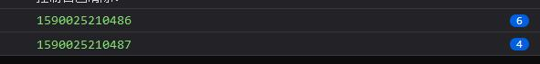
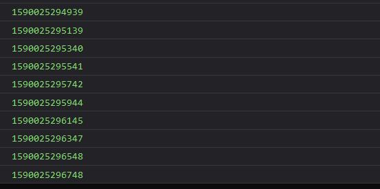

# 5 月
{: id="20201225101337-6tnxeuz"}

- {: id="20201225101337-daipuq7"}pubdate:2020-05-05 09:01:13
- {: id="20201225101337-4yea8gw"}tags:每日总结
{: id="20201225101337-89ouh78"}

---

## 2020-5-4
{: id="20201225101337-zyh421c"}

1. {: id="20201225101337-xrxzrdx"}[synaptic](https://github.com/cazala/synaptic) 这个 js 的神经网络库用起来挺简单的，训练他学习了异或
{: id="20201225101337-1f3dwys"}

## 2020-5-9
{: id="20201225101337-5zwyhze"}

1. {: id="20201225101337-monzse5"}[mask 遮罩使部分图片透明](https://www.zhangxinxu.com/wordpress/2020/05/css-mask-compress-png-image/)
{: id="20201225101337-03mhrjz"}

## 2020-5-12
{: id="20201225101337-aobe1v4"}

1. {: id="20201225101337-7rc3nk1"}CSS border-radius 值语法的解析，主要是斜杠的用法 [border-radius](https://www.w3.org/TR/css-backgrounds-3/#border-radius)
   {: id="20201225101337-tjckyxh"}

   > The border-radius shorthand sets all four border-\*-radius properties. If values are given before and after the slash, then the values before the slash set the horizontal radius and the values after the slash set the vertical radius. If there is no slash, then the values set both radii equally. The four values for each radii are given in the order top-left, top-right, bottom-right, bottom-left. If bottom-left is omitted it is the same as top-right. If bottom-right is omitted it is the same as top-left. If top-right is omitted it is the same as top-left.
   > {: id="20201225101337-zfbykk1"}
   >
   {: id="20201225101337-hvezrk5"}

   > border-radius 简写设置所有四个 border-\*-radius 属性。如果在斜杠之前和之后都给出了值，那么斜杠之前的值设置水平半径，斜杠之后的值设置垂直半径。如果没有斜杠，则两个值相等地设置半径。每个半径的四个值按左上、右上、右下、左下的顺序给出。如果左下角省略了，它就和右上角一样。如果省略了右下角，它与左上角是一样的。如果省略了右上角，它与左上角是一样的。
   > {: id="20201225101337-o797lrm"}
   >
   {: id="20201225101337-qrkdk9r"}

   
   {: id="20201225101337-d1o6tc1"}

   对于斜杠语法的理解：将斜杠之前和之后的看做两个部分按多值语法的规则补全，然后一一对应，前面的是水平方向的值后面的是垂直方向的值
   {: id="20201225101337-fr3s6w0"}
{: id="20201225101337-ftpas7i"}

## 2020-5-14
{: id="20201225101337-qva16ji"}

1. {: id="20201225101337-pmajsyl"}vscode 报了好久的错
   {: id="20201225101337-n83zr6e"}

   Couldn't download IntelliCode model. Please check your network connectivity or firewall settings. Error Message: EPERM: operation not permitted, open
   {: id="20201225101337-tao6via"}

   之前尝试通过管理员打开 vscode 就没问题，其实从上面的报错也能看出是没权限写文件，但我一直不知道真正的解决方案，今天找到了。
   {: id="20201225101337-2dpvx56"}

   那就是修改 vscode "vsintellicode.modelDownloadPath" 配置项为可写的目录
   {: id="20201225101337-8hfp0a3"}

   [参考资料](https://github.com/MicrosoftDocs/intellicode/issues/113)
   {: id="20201225101337-typvje2"}
2. {: id="20201225101337-siqw3sf"}yapi 在 API 详情页中显示 修改列表
   {: id="20201225101337-jddc597"}

   效果 
   {: id="20201225101337-xv12183"}

   使用油猴脚本实现的 [脚本地址](https://greasyfork.org/zh-CN/scripts/392139-api%E8%87%AA%E5%8A%A8%E6%8F%90%E5%8F%96) 实现方式是监听页面变化，切换到详情页后调用 yapi 接口查询修改记录然后添加到详情页上
   {: id="20201225101337-62o4tkt"}
{: id="20201225101337-p5hfx79"}

## 2020-5-18
{: id="20201225101337-86c3ca7"}

1. {: id="20201225101337-cuhg8gh"}js 通用拖拽多选工具函数 [ts 代码](https://www.typescriptlang.org/play?#code/GYVwdgxgLglg9mABINaNC-RoLE1CQCQCgJSIG8BYAKEXMQBsBTKRYSgQwHNEBeexygZ2oG5SFKrUSZAXMrtEAbQAMAGkTzFCmQF1EjbqLECyFCAm50AJjABuk43AggAttTBQAdBABO1RlGoBRGvcfYAESmZoG4ukIhTkYAnjQu3NwAKtQAHnQcAAYADnDcMLAIAFz0MKnUxnwARowQANbMrnDgxiWNjDF8cNm1BTElTgDMfJm6ghRWNv7OVXDGMU6M2dkOxgDCABYwlMbYIeHj5DR04oCX7oBG+pLiAPpQcNcX2OIHeuSTdg7OjMbG3mafABkYEYHNRXEFbM1eFYAO5gQIKbDUf6OfBsAB8hEOQkQBjA3Dg8UocGYEKhFTgcIRiGRnxeOIogDsEwCW-k53JD-ngIgzEDBgIgkSjnNBXJQANLUGL4YivHnkBgsSRQVwgfjYuXiWTqDi0xwuSgwT4ADW5cvImoAjNqaUL9YbHABNU1m3XObLuIUAEWowEYIEoUC5iAA9MHEIBuNMARtaADbzACXRgBkIwBccuqea7ondsgAFJo9ZieeBgIOhiORwDRcoA3uUASYqAQ5sU+QAL7Y+v0ibWD5676-IVAkFgMFkkC8DnUamCunsTEyuV8gUAQgVzGldZx7igIFcYGdQkbsqEmoATNa0xADcatxRNYMj7aT-aoE7l2dLhwbncHucnmIWwyorEiT6Mm0C4tUQABqRBAmyVJAnPN5zHTOJqCcDMrjEYCrTAiCoJg5dfygRCnBhGBjCgDZUOAw9EAAWiA84QPAyDoNgxA8IIjZqBgZgNkAp8pCvajaKkDCGOw51m2dd5pkWH4-kBYEvD7cFAkhQdqBAbJR1dNFJ2XGdsHnJhFyxXceVXddN2XHc5TxIxECgYxrgNWyOAAQVcVwOicYAmlsPY2ykgBHVVXBiABlagaGgOBXBcyhKCCeywnwTREAACSSABZAFfGoaYpFUZibJOQBaOSVBynOcYBti8cEkUobTEAuQAPt0AErlPwuBRUqgWxKBy6ZbnuR4ItwEbCsMQkkOJUknwUTBiqcWwlmwLqer6z4BvfXBZuK78cTmhalpW3q-HWt8LlwLzou8WoNmwFlpOMXahAXSRfR4NVZXE0gdzQLA8FIfCVka59pGDAAqMHEEAM91ACg5QAlyNSRAwbDMA7CqMEFHByHYbhmIkZRtGMZDCHEEAZ+V4cR5HEFR2x0dcTGSfJ3H8epwnXAK0gse0QAYlQuQAQtzEQBqJUACnVADi5aR5AwwBYOUAADlACztQB6Mxx-GAZiIHxEkKQabphRtaJvX6dZ2mwQ5khQEgQokCOtbHA2obKBKdKsptqBcBKC5jKEIrEHcaBJAipxmFoAAhZowFMMBmDWU9HAAJWoaAuWxMyN2kX3nBoYAoAUdPkO6HOE+cVxOO4gvoCcWYoDuWxTZ3c3oALYHWuwdOLXd84y6gfd26XWUzEYVwNGuWwYDAa5EY4VutWdfvB8YYfR+uPHJ8Li0hNNoRZ6HxbUnHyQp8PGeB+3xhd+Xn3V7403sS3qoF7HieL+gfdp5v4+75Hsfz-Tl+rSPweP6nz3ivZ+UhD5vwAcPIB39C4vyvGMWUKckDz0-nvAAPBwQBu9EYADIcEn2wYgdEmD757zwdvReeMMGICwUvRA5CUHQKISQ1BnRvqkFIPXS22g7YfnECUZ47dPYUD0pqNQRDtBgPUAAH2kZIjCmJLyqF7nKJB0gDyqFmmIK+WitS6KtBvCg9YaTvWEQyNR4gxLsJIKQMAjB7DcB6BAagiAWRmOEHQCqmt1ApSdtlE6jh8rOjSLkVwdAuGN07C3QuPd3Fe0MCYcwlh-KfBcO4TwPgAmBmCOYMIzFWLxAgIkFI6RJA5DyAUAsJQqrlEqDUeojQw6tEQO0To3Rej4QGMMUYuF4J-kmgBfehd6JYSYr0swCF4goRAVAdemFGI4RMnBCZ-TCLEVIkM6AUiBLpxGQs-JfT8LxHYiXQCuz+I0V2cJUZiy5QVScNkQct19j5JSXqWY8xFjLFWJsbYuwXlNmxCE6K4TwANwQBfYceA4kUHucAK6N1sB1QagHdkcBOSjWXF4jgQTAUkB3EAA)
   {: id="20201225101337-qvfgl76"}

   复制下面的代码到浏览器控制台执行，按住 ctrl 即可查看拖拽选中所有 td 元素的效果，修改其中的选择器即可实现拖拽选中任意想要可选中的元素
   {: id="20201225101337-fq0673j"}

   ```javascript{run}
   "use strict";
   function 拖拽多选() {
     let flag = false;
     let 选区 = [0, 0, 0, 0];
     const div = document.createElement("div");
     div.style.cssText = `position: fixed;background: gray;opacity: .3;`;
     document.body.appendChild(div);
     let 选区矩形 = 选区_to_矩形(选区);
     document.addEventListener("mousedown", (event) => {
       console.log("mousedown", event);
       遮罩.remove();
       if (event.ctrlKey) {
         flag = true;
         选区[0] = event.clientX;
         选区[1] = event.clientY;
         event.preventDefault(); // 阻止默认行为
         event.stopPropagation(); // 阻止事件冒泡
       }
     });
     document.addEventListener("mousemove", (event) => {
       if (!flag) {
         return;
       }
       选区[2] = event.clientX;
       选区[3] = event.clientY;
       选区矩形 = 选区_to_矩形(选区);
       div.style.left = 选区矩形[0] + "px";
       div.style.top = 选区矩形[1] + "px";
       div.style.width = 选区矩形[2] - 选区矩形[0] + "px";
       div.style.height = 选区矩形[3] - 选区矩形[1] + "px";
     });
     document.addEventListener("mouseup", (event) => {
       if (!flag) {
         return;
       }
       const td_list = Array.from(document.querySelectorAll("td"));
       const 选中 = td_list.filter((el) => 矩形相交(选区矩形, HtmlElement_to_矩形(el)));
       console.log(选区矩形, 选中.map(HtmlElement_to_矩形), 选中);
       选中.map(HtmlElement_to_矩形).forEach(遮罩.add);
       flag = false;
     });
   }
   拖拽多选();
   function HtmlElement_to_矩形(el) {
     const rect = el.getBoundingClientRect();
     return [rect.left, rect.top, rect.right, rect.bottom];
   }
   function 矩形相交(rect1, rect2) {
     var a_min_x = rect1[0];
     var a_min_y = rect1[1];
     var a_max_x = rect1[2];
     var a_max_y = rect1[3];
     var b_min_x = rect2[0];
     var b_min_y = rect2[1];
     var b_max_x = rect2[2];
     var b_max_y = rect2[3];
     return a_min_x <= b_max_x && a_max_x >= b_min_x && a_min_y <= b_max_y && a_max_y >= b_min_y;
   }
   function 选区_to_矩形(选区) {
     if (选区[0] > 选区[2] || 选区[1] > 选区[3]) {
       return [选区[2], 选区[3], 选区[0], 选区[1]];
     } else {
       return 选区;
     }
   }
   var 遮罩;
   (function (遮罩) {
     let list = [];
     function add(rect) {
       const div = document.createElement("div");
       div.style.cssText = `position: fixed;background: gray;opacity: .3;`;
       div.style.left = rect[0] + "px";
       div.style.top = rect[1] + "px";
       div.style.width = rect[2] - rect[0] + "px";
       div.style.height = rect[3] - rect[1] + "px";
       list.push(div);
       document.body.appendChild(div);
     }
     遮罩.add = add;
     function remove() {
       list.forEach((el) => el.remove());
       list = [];
     }
     遮罩.remove = remove;
   })(遮罩 || (遮罩 = {}));
   ```
   {: id="20201225101337-p19mpxb"}

    ~~如果是在 shenzilong.cn 站点查看本文章，可以按住 ctrl 在下面的表格拖拽尝试效果~~ #待办/网站升级导致一些功能不可用了，等待更新#
   {: id="20201225101337-belv76c"}

   | 拖拽 | 多选 | 测试 |
   | -------- | -------- | -------- |
   | 1      | 2      | 7      |
   | 3      | 4      | 8      |
   | 5      | 6      | 9      |
   {: id="20201225101337-apntgig"}
{: id="20201225101337-6ldtgr1"}

## 2020-5-19
{: id="20201225101337-tqtwj6v"}

1. {: id="20201225101337-22ur8fo"}[elementFromPoint](https://developer.mozilla.org/zh-CN/docs/Web/API/Document/elementFromPoint) 这个 dom API 可以返回当前文档上处于指定坐标位置最顶层的元素
   {: id="20201225101337-cvtj4sp"}
2. {: id="20201225101337-dr7ydm9"}利用 [elementFromPoint](https://developer.mozilla.org/zh-CN/docs/Web/API/Document/elementFromPoint) 写了一个 [去除顶部遮挡](https://greasyfork.org/zh-CN/scripts/403713-%E5%8E%BB%E9%99%A4%E9%A1%B6%E9%83%A8%E9%81%AE%E6%8C%A1) 的油猴脚本
   {: id="20201225101337-aq07wqi"}

   写这个脚本的缘由是因为 「容易吗我」发起的[脚本创建请求](https://greasyfork.org/zh-CN/forum/discussion/78198/求个脚本-阻止网页元素顶部滞留#latest)
   {: id="20201225101337-r8djyyl"}

   下面是他的论点，我也曾有过相同的感觉
   {: id="20201225101337-5p952b0"}

   > 不知道什么风刮的，现在很多网页都存有顶部滞留一大横条、占用有限的可视空间的问题。 比如搜索引擎，其实一旦用户输入了搜索词后，焦点已不再是搜索框了，还占着顶部空间有意义吗？ 求大神出个脚本，解除顶部冻结，让它随网页滚一边去。
   > {: id="20201225101337-f83z2q9"}
   >
   {: id="20201225101337-6a212mo"}

   核心思想是利用 elementFromPoint 找到顶部元素，然后大致的判断一下它会不会是顶部的遮挡屋，是的话就隐藏起来
   {: id="20201225101337-eq9v0c7"}

   [Todo]这里我感觉自己的判断不太好，但暂时也没想起来怎么做个更好的。有兴趣的可以 [去这里查看源码](https://github.com/2234839/userJS/blob/master/去除顶部遮挡/去除顶部遮挡.user.ts) 指点一下我
   {: id="20201225101337-khrftoi"}

   **效果** :
   {: id="20201225101337-4e2yv4g"}

   有顶部遮挡  无顶部遮挡 
   {: id="20201225101337-pkqo6vn"}

   [视频效果地址](https://www.bilibili.com/video/bv1xg4y1B7B7)
   {: id="20201225101337-cbrt34t"}

   <iframe src="https://player.bilibili.com/player.html?aid=838226532&bvid=BV1xg4y1B7B7&cid=192784553&page=1" scrolling="no" border="0" frameborder="no" framespacing="0" allowfullscreen="true"> </iframe>

   {: id="20201225162307-bzdl3j6"}
{: id="20201225101337-nbzz8g2"}

## 2020-5-21
{: id="20201225101337-ye5illw"}

1. {: id="20201225101337-geb4rhc"}一个让返回值是 promise 的函数顺序执行的函数
{: id="20201225101337-javmhtq"}

```typescript
type UnPromise<T extends Promise<any>> = T extends Promise<infer U> ? U : never;
function promise顺序执行<F extends (...args: any[]) => R, R extends Promise<any>>(f: F) {
  let old = Promise.resolve();
  return (...arg: Parameters<F>): R => {
    old = old.finally().then(() => {
      return f(...arg);
    });
    return old as R;
  };
}

// 下面是例子
function p() {
  return new Promise((r, j) => {
    setTimeout(() => {
      console.log(Date.now());
      r();
    }, 200);
  });
}
const p2 = promise顺序执行(p);
for (let i = 0; i < 10; i++) {
  p();
  p2();
  // 循环执行p2 则会慢慢的一个一个的打印
}
```
{: id="20201225101337-qsexe80"}

循环执行 p 会一下子全部打印出来
{: id="20201225101337-xicjatj"}


{: id="20201225101337-jf6y3yz"}

循环执行 p2 则会慢慢的一个一个的打印
{: id="20201225101337-a6bye6a"}


{: id="20201225101337-hotykcq"}

2. {: id="20201225101337-k77xzso"}提取 exe 中的资源和图片的工具
   {: id="20201225101337-igceb8a"}

   **MultiExtractor** 最终是用这个提取出了所有的 icon [下载地址](http://www.downxia.com/downinfo/253071.html) (没找到官网，我放沙盒中运行的)
   {: id="20201225101337-xl09l9z"}

   **reshacker** 这个看起来很强，但用于提取所有图片并不好使用
   {: id="20201225101337-7jq85ig"}
3. {: id="20201225101337-oe63ckn"}本地以图搜图工具 [嗅图狗](https://blog.csdn.net/sinat_27382047/article/details/83040411)
   {: id="20201225101337-flfsuiv"}
{: id="20201225101337-vpcvqli"}

## 2020-5-24
{: id="20201225101337-rqj5qfb"}

1. {: id="20201225101337-x7mhwgz"}今天起的比较早，打算把我的博客改成 svelte 的 sapper 来提供 ssr 渲染，结果浪费了挺多时间的。首先是 svelte 的 ts 提示还不太好，然后找的几个 sapper typescript 模板只有一个我跑起来了( [github 地址](https://github.com/elcobvg/sapper-typescript-rollup)) 跑完后发现页面中路径跳转不对，全都跳根路径去了。幸好记忆中有关于 base 标签的映像，排查这里花了一些时间但不是太多。这个问题的缘由在 [这里](https://github.com/sveltejs/sapper/issues/904) 我也在下面提了一个解决方案
{: id="20201225101337-gviy3qv"}

## 2020-5-27
{: id="20201225101337-tdetfuy"}

### 花朝日（花朝节）
{: id="20201225101337-4ol4eml"}

> 花朝节是汉族传统节日，又称花神节，或称作“百花生日”，其时间在各朝代地区不同，中国早期以农历二月初二、二月十二或二月十五为花朝节。清代后则一般北方以二月十五为花朝，而南方则以二月十二日为花朝节，与南北气候不同有关。节日期间，人们结伴到郊外游览赏花，称为“踏青”；姑娘们剪五色彩纸粘在花枝上，称为“赏红”。各地也有种花、赏花、挑菜、祭花神等风俗。原文网址：https://kknews.cc/culture/b2yepo6.html
> {: id="20201225101337-uhtmuah"}
{: id="20201225101337-kx40gcd"}

今日翻看今年五月三日游苏州穹窿山拍的照片了解了一下((20201225101337-4ol4eml "{{.text}}"))  
{: id="20201225101337-ucc45hi"}

## 2020-5-30
{: id="20201225101337-su9its7"}

### 解决 `Uncaught ReferenceError: exports is not defined`
{: id="20201225101337-kcmwbhl"}

这个问题我遇到有一点时间了，最近在 https://stackoverflow.com/questions/43042889/typescript-referenceerror-exports-is-not-defined 看到了解决方案，实际上之前在找解决方案的时候也翻看过这个页面，但那时候处于不知其然的状态，虽然现在可能也不够知其然 \`(_>﹏<_)′>) 但大致了解到这个问题是由于 commonjs 模块规范导致的， commonjs 模块不应该直接用于浏览器的，所以需要 `@babel/plugin-transform-modules-commonjs` 插件来转换一下才可以正常使用
{: id="20201225101337-67fq348"}


{: id="20201104153359-mfnccc5" type="doc"}
