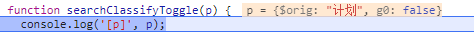
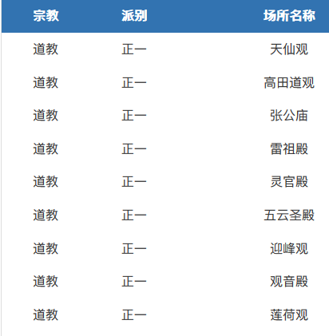

2020/1/1
{: id="20210101181148-y671muy"}

我是向来是一个不怎么做计划的人，今年做个计划吧，目标是**让自己处于正常的状态**
{: id="20210101181157-xctog8a"}

---

新年的第一个小项目： ((20210102035720-poopll6 "{{.text}}"))
{: id="20210102043656-5gq9ga1"}

---

CSS [env()](https://developer.mozilla.org/zh-CN/docs/Web/CSS/env()) 可用于实现避开苹果安全区之类的
{: id="20210102100326-lia7tyf"}

```css
body {
  padding:
    env(safe-area-inset-top, 20px)
    env(safe-area-inset-right, 20px)
    env(safe-area-inset-bottom, 20px)
    env(safe-area-inset-left, 20px);
}
```
{: id="20210102100358-7nlu884"}

---

[多台WIN10之间的SSH免密登录](https://zhuanlan.zhihu.com/p/111812831) ->
{: id="20210103091428-u9df7fi"}

<a href="./备份/多台WIN10之间的SSH免密登录.html" target="_blank">网页备份</a>

{: id="20210103091434-fok7t6a"}

~~vscode remote SSH 连接 windows server 总是断开的一个原因：经排查发现是我的 v2rayN(一个网络代理软件) 导致的，配置代理避开该服务器即可~~ 并不是，只是当时好了一小会....
{: id="20210103103620-nxhwak4"}

---

## ts 版 防抖函数
{: id="20210103195729-r6re2xe"}

```typescript
type unPromise<T> = T extends Promise<infer R> ? R : T;

export function debounce<T extends (...args: any) => any>(fn: T, time: number) {
  let timeout = 0; // 创建一个标记用来存放定时器的返回值
  return function (this: any, ...args: any) {
    return new Promise<unPromise<ReturnType<T>>>((resolve, reject) => {
      clearTimeout(timeout); // 每当用户输入的时候把前一个 setTimeout clear 掉
      timeout = setTimeout(() => {
        // 然后又创建一个新的 setTimeout, 这样就能保证输入字符后的 interval 间隔内如果还有字符输入的话，就不会执行 fn 函数
        resolve(fn.apply(this, args));
      }, time);
    });
  };
}
```
{: id="20210103195741-rrjjhpp"}

---

#日常# 新增整理 ： ((20210105091835-cdjfps5 "{{.text}}"))
{: id="20210105175738-54nz9sg"}

---

#日常# 今天突然发现在 [爱发电](https://afdian.net/@llej0)  收到了 5 元的赞助，非常开心 ヾ(≧▽≦*)o
{: id="20210108145237-0cauqm4"}

---

#日常# 新增文章 ： ((20210106142508-wr3ob9l "{{.text}}"))
{: id="20210106144621-60g5ti3"}

---

#日常# #闲评# 2021年了 微信小程序还不支持 `first-of-type` [微信社区相关](https://developers.weixin.qq.com/community/develop/doc/f13869b5f072904c7e9338f9089582d5) 
{: id="20210108144516-3kzdhpq"}

---

css 实现列表左侧线条样式，起始和结束少一半的线条长度。还有一个思路是 在第一个和最后一个元素上使用和背景色相同的颜色来覆盖原先的线条
{: id="20210108150849-8is7d3i"}

```css
  .c-item::before {
    content: "";
    --h: 100%;
    --h2: 0%;
    width: 1px;
    height: var(--h);
    background: #cccccc;
    position: absolute;
    left: 0px;
  }
  .c-item:nth-child(1)::before {
    --h2: calc(var(--h) - 50%);
    height: var(--h2);
    transform: translateY(50%);
  }
  .c-item:nth-last-child(1)::before {
    /** --h2 为了在只有一个 item 的时候让左侧边线消失 */
    height: calc(var(--h) - 50% - var(--h2));
    transform: translateY(-50%);
  }
```
{: id="20210108150821-hu3d7gz"}

---

css 实现三个点的动画效果
{: id="20210108162601-2thi76g"}

```css
.g-loading-dot {
	display: inline-block;
	min-width: 2px;
	min-height: 2px;
	box-shadow: 2px 0 currentColor, 6px 0 currentColor, 10px 0 currentColor;
	animation: dot 4s infinite step-start both; 
}

@keyframes dot{
	25% { box-shadow: none; }                                  /* 0个点 */
	50% { box-shadow: 2px 0 currentColor; }                    /* 1个点 */
	75% { box-shadow: 2px 0 currentColor, 6px 0 currentColor;  /* 2个点 */ }
}
```
{: id="20210108162614-wh204xc"}

---

#日常# ： 微信小程序 [在scroll-view中使用sticky的bug](https://developers.weixin.qq.com/community/develop/article/doc/000202ebeb046859fc99548c756813)。 #闲评# : 又耽搁我半个多小时
{: id="20210108164010-n7ytxox"}

- {: id="20210108164043-4x84fyv"}表征：滚动了一个 scroll-view 上设定的高度后设置 sticky 会被滚动上去
- {: id="20210108164129-g0tvsfz"}猜测原因：微信小程序的 sticky 的计算很可能是直接根据父元素的高度来计算了
- {: id="20210108164257-9xexyux"}解决方案：在scroll-view 中再套一层然后将所有元素放这一层里面
{: id="20210108164041-htgqybp"}

#日常# ： 新增文章 ((20210108200154-2j8bhxv "{{.text}}"))
{: id="20210108210504-wak0dar"}

#日常# 发现 Firefox 的一个奇怪实现，鼠标按住左键滑动选择一但进入 Web Components 就转为只选中 Web Components 中的内容，在 页面中 ctrl + a 也无法选中  Web Components 中的内容， Web Components slot 中的内容却是可以选中的
{: id="20210108210525-wg3ewab"}

#日常# 发现文章,  [如何看待 snabbdom 的作者开发的前端框架 Turbine 抛弃了虚拟 DOM？ - 徐飞的回答 - 知乎](https://www.zhihu.com/question/59953136/answer/170843322) 对于 vdom 和相关的 diff 讲的非常好
{: id="20210108213215-bzbfvtz"}

---

{{{
#日常# #uniapp/坑#  这个 v-for 的数组使用模板内定义的数据就得到了((20210112132412-5ymmx1m "很奇怪的结果"))，但使用变量的话就没问题
{: id="20210112132528-3sq0rll"}

参数 p 可能是 uni-app 内部的包装
{: id="20210112132412-5ymmx1m"}

}}}
{: id="20210112132435-hf7buhx"}

---

- {: id="20210115091355-u5i9rng"}[国家宗教事务局](http://www.sara.gov.cn/zjhdcsjbxx/index.jhtml) 可以很方便的查询某地有哪些宗教活动场所
  - {: id="20210115091358-mf7flvv"}今日方知我家旁边山上的观属于正一派系  {: style="zoom: 69%;"}
  - {: id="20210115095152-8y9my8k"}海宁这边则是佛教居多，道教只有一两个
  {: id="20210115091400-j32dmj8"}
{: id="20210115091259-df6insx"}

((20210115103808-12zcrqu "{{.text}}"))
{: id="20210115103730-zjjjse7"}

---

今天给 ((20201121142422-1gk6qv5 "{{.text}}")) 加上了动态内容块渲染的功能（效果： ((20210111192121-rd74g8n "{{.text}}")) ），期间尝试了很多方案，最终还是使用了 [xgo](https://github.com/karalabe/xgo) 这个令人难受的一点在于他要拉取网上的依赖代码，在国内的网络下下载速度令人十分不感动，尤其 lute 的代码库体积超大花了很长时间
{: id="20210115201952-hpczmmf"}

---

{: id="20210117165019-73zixzv"}

QQ 这一波扫描浏览器历史让人害怕[【知乎】如何看待 QQ 扫描所有浏览器历史](https://www.zhihu.com/question/439768601) 使用 [火绒的防护方法](https://www.zhihu.com/question/439768601/answer/1682468108)
{: id="20210117165019-fx122sl"}

---

{: id="20210118205219-7dm6sth"}

## 各浏览器打开调试页面的方法，远程调试手机
{: id="20210118205455-n0g4r1v"}

[[firefox]打开调试页面](https://developer.mozilla.org/zh-CN/docs/Tools/about:debugging#%E6%89%93%E5%BC%80%E8%B0%83%E8%AF%95%E9%A1%B5%E9%9D%A2)  地址栏输入：`about:debugging`
{: id="20210118205219-cwr3qp0"}

[[Edeg]打开调试页面](https://docs.microsoft.com/zh-cn/microsoft-edge/devtools-guide-chromium/remote-debugging/#%E6%AD%A5%E9%AA%A42%E4%BB%8E%E5%BC%80%E5%8F%91%E8%AE%A1%E7%AE%97%E6%9C%BA%E8%B0%83%E8%AF%95-android-%E8%AE%BE%E5%A4%87%E4%B8%8A%E7%9A%84%E5%86%85%E5%AE%B9)  地址栏输入：`edge://inspect`
{: id="20210118205345-v1kte8i"}

{: id="20210118205420-5cpu8em"}


{: id="20210101181148-phljk8h" type="doc"}
