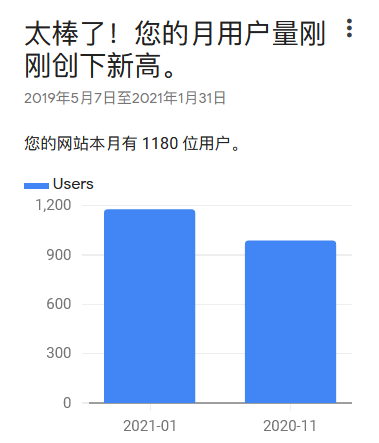

过去三十天 ((20201228124158-21iqhut "本站"))  的访客量达到了1180🎉 {: parent-style="font-family: var(--b3-font-family); background-color: var(--b3-theme-background); color: var(--b3-theme-on-background);"}
{: id="20210201164305-8h5ayvn"}

---

- {: id="20210224222234-xb9eglu"}发现 ((20201113141125-tilrnur "{{.text}}"))  的一个bug [https://github.com/microsoft/TypeScript-Website/issues/1589](https://github.com/microsoft/TypeScript-Website/issues/1589%E2%80%B8)
  {: id="20210224222234-pmz8un2"}

  - {: id="20210224222238-9z40aog"}发起 [pr](https://github.com/microsoft/TypeScript-Website/pull/1594) 尝试解决
    {: id="20210224222238-nefv756" updated="20210224222301"}
  - {: id="20210224230729-6n04lnu"}也算是给微软修过 bug 的人了， hahaha~
    {: id="20210224230729-72jdxsi" updated="20210224230802"}
  {: id="20210224222239-7nws5g8"}
{: id="20210223093802-gvix2po" updated="20210224222302"}

((20210225105308-l6ka6n4 "{{.text}}"))
{: id="20210224222231-68lyaap" updated="20210225105926"}

#想法# 实现一个浏览器插件，检查当前浏览的页面是否具有符合某些特征的链接，然后提交给后台，用来实现数据收集以及((20210225110544-v1qsyks "{{.text}}"))。
这里的数据收集是为了实现跨站的双链
{: id="20210223093840-vwzy5lk" updated="20210225111125"}

{: id="20210225111127-ahh91m6"}

{: id="20210201164305-8nne8fj" type="doc"}
