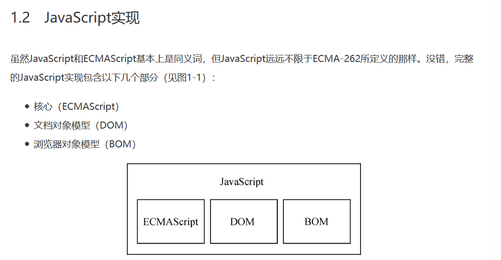

- {: id="20210309142321-mjnyws1"}((20210303161429-imqdv28 "{{.text}}"))
  {: id="20210309142321-41s26et"}
{: id="20210303141035-xy76map" updated="20210309142321"}

- {: id="20210303212529-zzkrn44"}[Index | Hegel.js](https://hegel.js.org/) 一个有意思的基于 js 的静态类型语言，比 ts 要克制和稳健严格许多
  {: id="20210303212529-icdun6t" updated="20210303214940"}

  - {: id="20210303212533-krp19nq"}[https://github.com/JSMonk/hegel](https://github.com/JSMonk/hegel)
    {: id="20210303212533-wwtwaxq" updated="20210303212543"}
  - {: id="20210303213933-nqy3bgs"}如下的((20210303213928-8x0msjx "代码"))所示([在线尝试 hegel](https://hegel.js.org/try#MYGwhgzhAECC0G8C+AoUkYCFoFMAeALjgHYAmM8yKKAZgK7HAECWA9sdDQBQAOAXHABOgsAE8APLAB8ASkQpoi6DwDaABgC60ALzRiOAO5wucgPSnogTfjA7BaAQt0CzJoB15QBTqy6IC45ISImYp0QG+mgPRmgJDmgHepgBkZtiioaOwQBNBgAIwCsMJikn66KvpGsCYascTx0ABGKV4ZvjrQOYbQmAW0XMkyzeVmFgAqojw40ABEad7ivgPQzDDMjKwAtjxgLKUg-QbMBAAW0AS9-UPpEtID1EA) ,[在线尝试 ts](https://www.typescriptlang.org/zh/play?#code/MYGwhgzhAECC0G8C+BYAUKSMBC0CmAHgC54B2AJjPMuugGYCupwRAlgPanR0AUADgC44AJ2FgAngB5YAPgCUidNGXQ+AbQAMAXWgBeaKTwB3ODwUB6c9ECb8YHYLQCFugWZNAOvKAKdVXRAXHIixU7DOhAN9NAejNASHNAO9TADIz7dFQ0dGBOCCJoMABGIVhRCWkA-TVDE1gzLQSklIAjDJ8c-z1oAuNobBL6HnS5NqqLKwAVcT48aAAiLN9Jf2HoVhhWZnYAWz4wNgqQIaNWIgALaCIBodHsqVlh2jQgA)) ，这段代码如注释而言是存在问题的，但 ts 不会报错，而 hegel 会报错
    {: id="20210303213933-8gyfxyb" updated="20210303214542"}
  - {: id="20210303213928-8x0msjx"}
    ```typescript
    class A {}
    class B extends A {}

    function f(p: Array<A>) {
        p[0] = new A() // 这样的操作在 p 为 Array<B> 时有隐患，可能破坏其他代码对 p 所指向的数组的类型期待
    }

    const a1: Array<A> = [new A()]
    const b1: Array<B> = [new B()]
    f(a1)
    f(b1) // Type "Array<B>" is incompatible with type "Array<A>"
    ```
    {: id="20210303213928-l5jn44o" updated="20210303214916"}
  {: id="20210303212533-glxna8i"}
{: id="20210303161413-0xift4p" updated="20210303214135"}

- {: id="20210309095605-04ylhvl"}git 仅拉取最新代码的方法： `git clone --depth=1 仓库地址` ，可有效节约下载时间与磁盘占用
  {: id="20210309095605-r765q34"}
{: id="20210303205810-6fq753w" updated="20210309095605"}

- {: id="20210304103458-iluxcjl"}突然有一个 #想法# ，对于 js 内置的方法和对象进行包装，使其从 `throw err` 变成 `return err` 这样能够提供对于错误的类型提醒
  {: id="20210304103458-6sr0tfa" updated="20210304144458"}

  - {: id="20210304144416-i0s2i39"}[最简 demo](https://www.typescriptlang.org/zh/play?#code/C4TwDgpgBA8gbhATgd0QS2BAPAFQDRQCqAfFALxQAKaAxgNa4ECiAHjQDYCuAJtnRCAD2AMyj4o-IaJKkAZEQDcAWABQqmoIB2AZ2BQA+uSiaIyKokEsQACgDeAXwK3VqqG6gB6D1ECb8YBnEwE-tQE7TQFWbQBC3QGAYwApXQG34wBkIwFBlQFGIwBh-wDAdQExUwHvowDm5KGAACwszQE5TQAQjKEQIYE5ETRcVewBKKABDbShnFXcoV3cvXz8wwG8fQGj1QE4LQDtjQHDTQGMLQHxXMoa3ACkAZRgAOQAuWAQUdEwsPrdQSBEoda28E87btzBWxG0IXesAOk+ngHNdyifWgBbapIbRYM4QC5XTYAbQARI9nhA4QBdYgtMikVqaEBQAA+UDWIE0wFaLCYiAsiGU3Xc9j6xBp9hpDX072h70RL2sAHIHDymjSgA)
    {: id="20210304144416-d1sot3c" updated="20210304144444"}
  {: id="20210304144416-8o1nxrp"}
{: id="20210303210010-949bprt" updated="20210304144500"}

- {: id="20210309095421-l7lyhq2"}[hosts 文件 windows 10 文件地址](C:\Windows\System32\drivers\etc\hosts)
  {: id="20210309095421-5prjkj1" updated="20210309095445"}
{: id="20210309095415-je7j1ty" updated="20210309095424"}

- {: id="20210309105503-ryoaflw"}#疑问#  [react typescript usememo deps 怎么处理联合类型？ - 知乎](https://www.zhihu.com/question/448372603)
  {: id="20210309105503-wy1f12g" updated="20210309105558"}

  - {: id="20210309142056-e9pbott"}[https://stackoverflow.com/questions/66541801/how-does-react-typescript-usememo-deps-handle-union-types](https://stackoverflow.com/questions/66541801/how-does-react-typescript-usememo-deps-handle-union-types)
    {: id="20210309142056-ikp5wtv" updated="20210309163658"}
  {: id="20210309142057-iht3dmv"}
{: id="20210309095450-gcr7o8x" updated="20210309142059"}

- {: id="20210310100618-r9i8hlh"}[js 方言、（编译成 js 的语言）列表](https://github.com/jashkenas/coffeescript/wiki/List-of-languages-that-compile-to-JS)
  {: id="20210310100618-5xrc9ki" updated="20210310100734"}
{: id="20210309163659-k2ecc2i" updated="20210310100619"}

- {: id="20210311191452-czvt8a0"}((20210311191530-v6y7ex5 "{{.text}}"))
  {: id="20210311191452-egwz61t" updated="20210311191522"}
{: id="20210311165615-cy0ooal" updated="20210311191530"}

- {: id="20210312125814-j1s7qp4"}[阿里云 ossutil 命令行上传工具 - 文档](https://help.aliyun.com/document_detail/120075.htm?spm=a2c4g.11186623.2.8.7f5424dewXd9C2#concept-303829)
  {: id="20210312125814-jiazhoe" updated="20210312125836"}
{: id="20210311165640-vxeaopl" updated="20210312125924"}

- {: id="20210312132832-e615yay"}nginx 重定向静态资源文件到其他地方, 例如我的博客将下列类型的文件重定向到了我在阿里云 oss 所存放的地方，这样将博客服务器的这部分上行压力转移给了 oss
  {: id="20210312132832-a3b4131" updated="20210321131108"}

  - {: id="20210312132855-td5pcn2"}
    ```nginx
            location ~ .*\.(gif|jpg|jpeg|png|mp4|mp3|aac)$ {
                rewrite /(.*) https://store-llej.oss-cn-hangzhou.aliyuncs.com/doc/$1;
            }
    ```
    {: id="20210312132855-18ga3c6" updated="20210312132919"}
  {: id="20210312132907-5lmupdj"}
{: id="20210312125837-nvh64uv" updated="20210312132832"}

- {: id="20210312163347-p618jze"}今天终于让这个可以使用了 [web font serverless 版 在线尝试地址](http://webfontserverless.shenzilong.cn/)
  {: id="20210312163350-cygcjax" updated="20210312163416"}
{: id="20210312132901-muuvt7e" updated="20210312163358"}

- {: id="20210312182840-htoqjib"}可用于优化 web 体验的 无损压缩算法 Brotli
  {: id="20210312182840-5ffiwn6" updated="20210312182852"}
{: id="20210312182835-fo3due2" updated="20210312182840"}

- {: id="20210313185835-0hd5q76"}((20210313185853-87zajkh "{{.text}}"))
  {: id="20210313185835-bi8i5sp" fold="0" updated="20210313185851"}
{: id="20210313185833-931tddo" updated="20210313185853"}

- {: id="20210316171018-piau31l"}今天博客来了一个 云浮 的访问者，我很喜欢在其他网站将所在地址填成云浮，今天居然碰到了真的🤣
  {: id="20210316171018-ccet8vf" updated="20210321131032"}

  - {: id="20210316171018-hl9j764"}
    {: id="20210316171018-8m6rutx" updated="20210316171018"}
  {: id="20210316171018-b16hw7q"}
{: id="20210316171012-50upp05" updated="20210316171014"}

- {: id="20210321140105-jbtns9y"}((20210321135933-s41eepw "{{.text}}")) ： 一个非常好的历史类应用
  {: id="20210321140105-rofe7o3" updated="20210321140209"}
{: id="20210321140044-g7r4kfq" updated="20210321140105"}

- {: id="20210321142230-2bhirxg"}((20210321142309-wn4sd7t "{{.text}}")) : 一个跳转到任意网页对应文本处的解决方案
  {: id="20210321142230-gbqopzk" updated="20210321142338"}
{: id="20210321140114-6y1bl0d" updated="20210321142309"}

- {: id="20210321145300-uhmjqym"}((20210321144243-bwrm25x "{{.text}}"))
  {: id="20210321145300-qyvkjo0" updated="20210321145414"}
{: id="20210321142311-0zcu4wf" updated="20210321145441"}

- {: id="20210322143514-8llxx0s"}((20210322143546-fmh2888 "{{.text}}"))
  {: id="20210322143514-tuiewzt" updated="20210322143540"}
{: id="20210321145347-ef788z8" updated="20210322143546"}

- {: id="20210322201930-5u0zykp"}突然想到了「闻鸡起舞」这个成语，但鸡是过一段时间叫一阵一直叫到白天的，所以祖逖他们晚上不睡觉的吗？
  {: id="20210322201930-54hk13v" updated="20210322202305"}

  - {: id="20210322201947-doen6mt"}
    {: id="20210322201947-cvsy0jq" updated="20210322201949"}
  {: id="20210322201948-c1ynajy"}
{: id="20210322201928-274t1tn" updated="20210322201930"}

- {: id="20210322203116-qn8pgze"}[mdn js 属性的可枚举性和所有权](https://developer.mozilla.org/zh-CN/docs/Web/JavaScript/Enumerability_and_ownership_of_properties)
  {: id="20210322203116-bj5tgdc" updated="20210322203146"}
{: id="20210322202131-6h0thzf" updated="20210322203133"}

- {: id="20210322210633-t6wdqlo"}ts 中的 Object.keys 为啥获得的 key 类型不是 keyof obj?
  {: id="20210322210633-l50rioi" updated="20210322210707"}

  - {: id="20210322210707-btf76eq"}[ts 官方的解答](https://github.com/microsoft/TypeScript/pull/12253#issuecomment-263132208)
    {: id="20210322210707-dv2crxa" updated="20210323083103"}
  - {: id="20210322211852-f2wkhkn"}[尝试说明为啥不行的演示代码](https://www.typescriptlang.org/zh/play?#code/MYewdgzgLgBCBGArGBeGBvGYCGBbApgFwwDk2JMAvgFDXAA22EEMAghtTFzNigIzUaDJiwBCMfAA8o+MABMW7dJ27wUAJkG1QkWNkLsUYfAHcYogBQBKagGt8ATwgXsVgHQAzEACcAotmAACwtbFAA+ZW4YAHpomEBN+MAZxMANbUAKdUAwuUA71MAMjMAYf5UuAEsPEJQykngSK2VaKMp8egh8GGLSsoAibHbq2gKqBqaWktCO4G6aur6dCBB6fDd6EABzEJtKG3snC2MzSyt3Lz8A4NCIvtiElIyc-KjWkZQKqpq++sbm+7KUTvHeuoGPsMvu0xj1XlNwDM5gtlqtBDZqBcAPJIfDAKBuTbOBCIA4+fxBEKOcLKC5RHEAbU2AF1EXF1rRkaj0W5ZFBvIV8NikHijoSqY4ADQAN2w9AArvhqSS6VE4EgKbSLgyLocYBZprABQ5BTBRRKpXAPDAUYg0Ri2RyuRYcfsOGSYNNZvNFisAAYAEnQm0oxC9+sllDdVgA3LKaBcsTaeZ58cciQ4ZQ6uJSaeGER5xWB0YVwDAsQAeAAqEmksgU8rN6LC0cQhCLVkICZAxobisi3G8+Cg4u8YBNzIxUdtPBY2DADi0ssKYBk3g8AWapvNpLiUULJakMnkLBx5prIGIDeIzdbVkVYeVjLimpganUo5gWdsYBAJn7TB417vmMc3NxsZ8icxJnMmlbakq9I2EAA)
    {: id="20210322211852-g47yvqf" updated="20210322211917"}
  {: id="20210322210707-f5hjq9w"}
{: id="20210322203128-zyjzs5z" updated="20210322211853"}

- {: id="20210323135749-tt3px6d"}感觉 《JavaScript高级程序设计（第4版）》[ 这个说法](https://www.ituring.com.cn/book/tupubarticle/32487#article:~:text=%E4%BD%86JavaScript%E8%BF%9C%E8%BF%9C%E4%B8%8D%E9%99%90%E4%BA%8EECMA%2D262%E6%89%80%E5%AE%9A%E4%B9%89%E7%9A%84%E9%82%A3%E6%A0%B7%E3%80%82)有点不讲道理，随意的扩大了 js 的定义
  {: id="20210323135749-9zl55ky" updated="20210323135848"}

  - {: id="20210323135814-1u8vivp"}
    {: id="20210323135814-199dva1" updated="20210323135817"}
  - {: id="20210323143419-3zx0e3n"}
    {: id="20210323143419-d9wuwit" updated="20210323143421"}
  {: id="20210323135815-3nvxb9r"}
{: id="20210322210709-mueoa4o" updated="20210323135850"}

- {: id="20210323143344-8t7r6vs"}[javascript 20 年](https://cn.history.js.org/)
  {: id="20210323143344-35nmbiu" updated="20210323143434"}
{: id="20210323143343-eqjnnkx" updated="20210323143431"}

- {: id="20210325151007-0wjigqa"}给 malagu 写了一点文档
  {: id="20210325151007-ed5uom5" updated="20210325151015"}

  - {: id="20210325151016-r51p3hs"}[属性配置案例](https://www.yuque.com/cellbang/malagu/yuyvg0)
    {: id="20210325151016-lr2jrw7" updated="20210325151046"}
  - {: id="20210325151034-it4oib6"}[前后端分离示例](https://www.yuque.com/cellbang/malagu/sl6eii)
    {: id="20210325151034-9no5xeu" updated="20210325151058"}
  {: id="20210325151016-i2qohj4"}
{: id="20210323143401-55ktrfv" updated="20210325151056"}

- {: id="20210325154228-a3t98y5"}((20210325154235-xo42dww "{{.text}}"))
  {: id="20210325154228-0m34wve" updated="20210325154229"}
{: id="20210325151032-9uqnpwe" updated="20210325154235"}

- {: id="20210325162726-8tum9kl"}[ts 演示 父子类所构成的数组并不是父子关系](https://www.typescriptlang.org/zh/play?#code/MYGwhgzhAECC0G8BQ1XTNAvNAjEgvkqJDAELQCmAHgC4UB2AJjPMmtAEZbQBMBR4KNADClWg2ZxEKNMG59CRAPb0INTgC5opANoBdbvuWr1YLbH3cuAemvRAFzaB4Q0Cb8YBnE9NEAhboDztQKJpgHgVAejNtIyQwHQAGA2x6CgB3EQAKAEokJA5IvQA6Gzs3QA1tQAp1QDvUwAyMzkzoP2DRQEKbQEhzTiQgA)
  {: id="20210325162726-k5gm0ix" updated="20210325162747"}
{: id="20210325154237-vx3dqd9" updated="20210325162756"}

- {: id="20210326105055-51r7m91"}((20210326105109-gzk63km "{{.text}}"))
  {: id="20210326105055-1k1ba99" updated="20210326105108"}
{: id="20210325162757-i2ikiej" updated="20210326105109"}

- {: id="20210326164908-ezigym0"}[从超过100万个项目中搜索C++ (Cpp)代码示例](https://cpp.hotexamples.com/zh/)
  {: id="20210326164908-7rt0ds6" updated="20210326164922"}
{: id="20210326105111-4488zi6" updated="20210326164918"}

- {: id="20210327075933-buz4spw"}[electron-vue-next](https://ci010.github.io/electron-vue-next/zh/)
  {: id="20210327075933-h37zbwt" updated="20210327075944"}

  - {: id="20210327075950-hgry4nj"}electron + vue3.0
    {: id="20210327075950-omciphs" updated="20210327080000"}
  {: id="20210327075950-54k3kpd"}
{: id="20210327075932-w71ihfv" updated="20210327075945"}

- {: id="20210329135434-waqkr3n"}((20210329135444-6rfsl2l "{{.text}}"))
  {: id="20210329135434-703lm77" updated="20210329135444"}
{: id="20210327133537-t2sb3qz" updated="20210329135444"}

- {: id="20210330075554-2p3cwrv"}((20210330075700-7dekwqy "{{.text}}"))
  {: id="20210330075654-ze4nyd2" updated="20210330075655"}
{: id="20210329135445-25c001o" updated="20210330075700"}

- {: id="20210330134956-toixz4q"}#疑问# [js 一个函数执行的时候如何判断自己是否处于另一个的调用栈中？ - 知乎 (zhihu.com)](https://www.zhihu.com/question/452024776)
  {: id="20210330134956-um9islp" updated="20210330135030"}

  - {: id="20210330160323-25x0fpn"}[尝试使用调用栈](https://www.typescriptlang.org/zh/play?#code/GYVwdgxgLglg9mABACwIZgCYBsCmAnACmgA8AuRdATwBpEwdipyAxcaeMASkQG8AoRCnTZ8AOjzgAcgyhEoxWvUacA3HwC+fMKgC2OAM4AHVBBxDMuPLwGIICfVFvyAsqkOIAvHRwB3RK8MAHgc8GDAAc1oqAD4CVRsGQzg8R1BIWAREcJwoAGF5OOtBQTswB0QHEwBrT28-AFE8PGS40UqIKrVixBhgRAJ2qu5+bpL7RxgMACUDECxHL0HRHVQoCGQCAHpJgH0AHQwAagB+HbOd3fPN+NGevoJJmf05xwAyV6diANE0fQfp2bzADaAAYALqcYY2W54HIgPBIEjfbKyR6AqCgiFdUbqRA4LD6MwjW6IKDIZp+ABEYDgqTCGB6GEp2O6mlZeIJROhxTJFMQ1NpiGA9IqUGqzO5bMQUsSyVSbAySFQGAw+WI-3IITCkU+5CoUO6SLcbRy-1oJBu0oSxCSKSFCo4iAkYGkjDkZAoYBoQpYDoQBuKpXKk1qAGUoKEIgRuYJKbtKYhDogACKrHCiGk+QpJ1xk8TCOA6bP884XDClynUbmccQ4QxYEw4AiU0SV-mUy2CZWqgqTc3yTt4gBuqCwBAABgQ0uxMgASHiTdRTzg8YBxdSccecZfYzSaTabRCAf3lABSugAlTQA55nw0BZ8M2SIgAIxtwoeaJFWz2OC4URYODhe95GfWgbxEPBRBRNU4niDc1FAyxAOIRAACYX24N8P0JKAABUYD0OAQFkV932JMYym-dM-wAykSFQkDhEsCCcigyFd1oR8QU4mD4iAA)
    {: id="20210330160323-0a5rvff" updated="20210330160342"}

    - {: id="20210330160438-bx809dg"}难以获取完整的调用栈
      {: id="20210330160438-oy9frna" updated="20210330160450"}
    {: id="20210330160438-ust4xze"}
  - {: id="20210330160347-ucwsd5s"}[尝试使用throw的方式转移控制流](https://www.typescriptlang.org/zh/play?#code/FAMwrgdgxgLglgewgAgBYEMIBMA2BTAJwApYAPALmUwE8AaZCPUmSgMUlkQgEpkBvYMjSZchAHQFIAOSYwSMUvUbNuAbmABfYBHQBbPAGcADuih5h2fAX6DkUHOgMHkAUWSy82Zy4IEE1gSEhKCQDGElYfyIjMAAjHDgoBlk2DngkXkCgoQMwI0IiblshLRLbJiN-GGRwaHSUAHM8GABhBSJlFmR2Oq5M4uQYVD8Ad2Sxlw7ZIrKhCqqqA2poGrSuZEkIGWZ5CioIOhrU3oybbPDqM+yqEfQ4apBCgY07dBgoVGQiPH7r5DgQF9zHAIGFMGYEICXL8-u4xJ1djNri88DgDOYsn8hqN3ANZkFSsgtFpgAB6UnIQD+8oAKV0AEqaAHPNgBhLAUAERkZAARlZ9EKyAAvAA+K7M0QEMRNVrtREC4WYuyhBD4MQ4BANIjshTc+hkJEaIr69SiqwajkAJh5i2WST5Qqu6Fu93GyAACn5dHB0UQiAReHb0TAACpwfQIMByAj0TkABlj3CRxvEkrapG9utlV2CiuVqvVmtIFp1Cj1BrUwCAA)
    {: id="20210330160347-qwfdd7p" updated="20210330160435"}

    - {: id="20210330160454-w3y9lab"}需要比较严格的错误处理以及使用 await 而非其他形式的异步调用
      {: id="20210330160454-p1aosis" updated="20210330160502"}
    - {: id="20210330160514-1a4zbi5"}使用的时候是回调风格不能封装成 promise 不好看
      {: id="20210330160514-z93219z" updated="20210330160546"}
    {: id="20210330160454-9ghru67"}
  {: id="20210330160323-ia3bu1c"}
{: id="20210330075652-0mqj3fy" updated="20210330160513"}

{: id="20210330134958-yp1xp7h"}


{: id="20210303140939-kgbmsqn" type="doc"}
