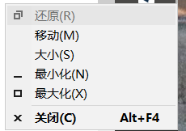

- {: id="20210427205237-p4kzfih"}((20210401083345-h0z90rh "{{.text}}"))
  {: id="20210427205237-fb0423c" updated="20210427205241"}
{: id="20210401083704-u97ycxm" updated="20210427205237"}

- {: id="20210401092633-l9gzlj3"}记录一下[第一次和尤雨溪互动](https://www.zhihu.com/pin/1360850449831178240#Popover20-toggle:~:text=%E6%B2%A1%E6%9C%89%E9%80%82%E9%85%8D%20Firefox%20%EF%BC%9F%20TypeError%3A)
  {: id="20210401092633-f0tmv4k" updated="20210401093019"}

  - {: id="20210401093037-c697yuv"}{: style="width: 356.4px;"}
    {: id="20210401093037-5gplc9l" updated="20210401093037"}
  {: id="20210401093038-zgertkv"}
{: id="20210401083714-o4jh7qk" updated="20210401092942"}

- {: id="20210401171656-nt6p4m3"}((20210401171714-bbrvuw7 "{{.text}}"))
  {: id="20210401171703-m7ufqis" updated="20210401171713"}
{: id="20210401093054-1kiy8yc" updated="20210401171714"}

- {: id="20210403195639-kqhke63"}❤ ((20210409090637-h0drlqf "{{.text}}")) [在线代码尝试](https://codesandbox.io/s/eager-forest-p46iq?file=/src/index.ts) 这个可以完美解决 ((20210330134956-um9islp "{{.text}}"))
  {: id="20210403195639-rtqtffm" updated="20210409090655"}

  - {: id="20210409090958-5gux29b"}((20210409090813-ufcwxmh "{{.text}}"))
    {: id="20210409090958-9p8uc3f" updated="20210409090958"}
  {: id="20210409090959-1y5z30d"}
{: id="20210401171715-k7adz3c" updated="20210409091000"}

- {: id="20210405114931-rwo6hof"}[在 V2EX 抖个机灵：对表达式「房租占工资百分比」求值失败，MathError: For the expression '0/0' not found the result](https://www.v2ex.com/t/768000#r_10404766:~:text=%E5%AF%B9%E8%A1%A8%E8%BE%BE%E5%BC%8F%E3%80%8C%E6%88%BF%E7%A7%9F%E5%8D%A0%E5%B7%A5%E8%B5%84%E7%99%BE%E5%88%86%E6%AF%94%E3%80%8D%E6%B1%82%E5%80%BC%E5%A4%B1%E8%B4%A5%EF%BC%8CMathError%3A%20For%20the%20expression%20'0%2F0'%20not%20found%20the%20result)
  {: id="20210405114931-szp8m2b" updated="20210405115011"}
{: id="20210403195805-ri3t1am" updated="20210405114958"}

- {: id="20210405193840-z0utz3h"}要分析一个需求的根因，不然即便实现了这个需求所要求的还是会失败，因为并没满足用户（这或许就是需求频繁变动的原因 => 用户没有正确的描述出自己的目的或者倾听者没有正确理解） [比如用户跟我们说，他要一
  辆自行车。我们去分析他的根因，发现他的目的是去上班](https://github.com/Kenneth-Lee/MySummary/blob/f50c600665bf12fcdc55a8f430e07200a9d7b893/%E8%BD%AF%E4%BB%B6%E6%9E%84%E6%9E%B6%E8%AE%BE%E8%AE%A1/%E8%A7%86%E5%9B%BE%E5%92%8C%E5%86%B3%E7%AD%96%E9%9D%A2.rst#user-content-id3:~:text=%E6%88%91%E4%BB%AC%E5%8E%BB%E5%88%86%E6%9E%90%E4%BB%96%E7%9A%84%E6%A0%B9%E5%9B%A0%EF%BC%8C%E5%8F%91%E7%8E%B0%E4%BB%96%E7%9A%84%E7%9B%AE%E7%9A%84%E6%98%AF%E5%8E%BB%E4%B8%8A%E7%8F%AD%E3%80%82)
  {: id="20210405193840-7if7k0w" updated="20210405194128"}
{: id="20210405115000-gauxdwq" updated="20210405193905"}

- {: id="20210406135001-p7namjb"}#日常# ESM 下想要在自己的代码内去重写其它模块的函数好难啊，突然对 es 模块规范的好感丢失了
  {: id="20210406135001-gm9jub8" updated="20210406135846"}

  - {: id="20210406135853-l03wccb"}[codesandbox 中测试 重写 improt 的变量是可行的，这大概是因为他使用 parcel 编译的原因，真正的使用 ESM 是无法重写的](https://codesandbox.io/s/chongxie-import-debianliang-qp9ed?file=/src/index.ts)
    {: id="20210406135853-t1tnqk5" updated="20210406135953"}
  - {: id="20210406140210-dqwj0xc"}[stackoverflow 相关问题](https://stackoverflow.com/questions/48168601/change-the-value-of-imported-variable-in-es6)
    {: id="20210406140210-4t2okto" updated="20210406140222"}
  {: id="20210406135854-ah94drt"}
{: id="20210405193848-ekchttv" updated="20210406140218"}

- {: id="20210406212159-va7k0j7"}#日常# npm 在 windows 上使用 npm install git+https://xxx 不会安装相关依赖，但在 github actions 环境下会安装其他依赖，我炸了
  {: id="20210406212159-78q9iuv" updated="20210406212311"}
{: id="20210406135954-ksv58cd" updated="20210406212206"}

- {: id="20210407192827-vb8sshr"}((20210407192843-1xalt6t "{{.text}}"))
  {: id="20210407192827-gzurbyw" updated="20210407192843"}
- {: id="20210407192844-61wuekj" updated="20210407192844"}[jexl](https://github.com/TomFrost/Jexl)
  {: id="20210408200010-1xlr85t" updated="20210409135036"}

  - {: id="20210409135024-e555gm2"}((20210409134801-rh4nbuk "{{.text}}"))
    {: id="20210409135024-s37oa0s"}
  {: id="20210409135024-62lvb53"}
{: id="20210407192826-61qtz8s" updated="20210409135037"}

- {: id="20210410202604-hc5wlyr"}((20210410202607-9aupc9h "{{.text}}"))
  {: id="20210410202604-7kwk67f" updated="20210410202604"}
{: id="20210407192845-h58sdk5" updated="20210410202607"}

- {: id="20210411105651-899jm8d"}((20210411105659-pcgjcao "{{.text}}"))
  {: id="20210411105652-llvva2e" updated="20210411105707"}
{: id="20210410202609-cui5qwt" updated="20210411105656"}

- {: id="20210415164007-wt09ssu"}❤ [Prepack · Partial evaluator for JavaScript](https://prepack.io/) ：在编译 js 时对可以确定结果的代码进行提前计算，从而简化生成的代码。
  {: id="20210415164007-8gqv73b" updated="20210415165259"}

  - {: id="20210415183421-35a8trd"}这个项目基本不被维护了 [Is prepack dead? · Issue #2639 · facebook/prepack (github.com)
    {: id="20210415183421-6c0npz8" updated="20210416114450"}
  {: id="20210415183421-12tu6g7"}
- {: id="20210416114453-6pfeo17"}刚刚看阮一峰第100期的评论的时候看到这条，有点生气。
  {: id="20210416114452-snvranp" updated="20210416114525"}

  > 崮生 说：
  > {: id="20210416114241-czvz65l" updated="20210416114253"}
  >
  >> 引用展翼骐骥的发言：那个裁切中文字体的仓库可能并不是原创，因为我恰巧在前几天使用了font-spider。你可以在github上找到它并自定义的使用它。
  >> {: id="20210416114332-mhq5dh2"}
  >>
  >> 我对那个物联网虚拟机EVM感兴趣。看到那个3D打印的面罩让我想到，以后会不会出现像今天打印店一样多的3D自助制造中心。这个时候你买一个商品并不是买实物商品，而是购买一个设计文件，然后在打印店支付打印耗材。
  >> {: id="20210416114336-5a6pxqz" updated="20210416114350"}
  >>
  > {: id="20210416114254-auoeouw" updated="20210416114349"}
  >
  > 你如果认真看了我 github 该项目的 readme 就应该知道我下面明明白白的鸣谢了 fontmin，而关于字蛛（font-spider） 我文章中也写了他的问题，强调了我这个项目的特点是动态的使用不同文字的字体2021年4月16日11:40| # | 引用
  > {: id="20210416114352-2zxw7g9" updated="20210416114436"}
  >
  > ---[阮一峰博客中的评论](http://www.ruanyifeng.com/blog/2020/03/weekly-issue-100.html?20210416114056#comment-quote-426398:~:text=%E5%B0%B1%E5%BA%94%E8%AF%A5%E7%9F%A5%E9%81%93%E6%88%91%E4%B8%8B%E9%9D%A2%E6%98%8E%E6%98%8E%E7%99%BD%E7%99%BD%E7%9A%84%E9%B8%A3%E8%B0%A2%E4%BA%86%20fontmin%EF%BC%8C)
  > {: id="20210416114439-kckrps2" updated="20210416114439"}
  >
  {: id="20210415164112-sq7e5wj" updated="20210416114326"}
{: id="20210411105700-at74n6d" updated="20210415164007"}

- {: id="20210418154955-w3g5xo7"}[**uni-composition-api** 兼容UniAppVue2中composition-api的使用，以及提供UniApp生命周期钩子。](https://github.com/TuiMao233/uni-composition-api/issues) 集成了我以前发在 dcloud 论坛的 [composition-api 补丁](https://ask.dcloud.net.cn/article/37563?notification_id-892685__item_id-40391) 、 [生命周期补丁](https://ask.dcloud.net.cn/article/38160?notification_id-892784__item_id-40394)
  {: id="20210418154955-zrz5ev6" updated="20210418155658"}

  - {: id="20210418155522-6moyt8d"}看着基于我发布的文章实现的项目有一种微妙的成就感
    {: id="20210418155522-lffljpw" fold="0" updated="20210418155629"}
  {: id="20210418155522-yrvdu8u"}
{: id="20210416114359-8qvludz" updated="20210418154955"}

- {: id="20210421165146-u158eoc"}((20210421165200-zklfi5r "{{.text}}"))
  {: id="20210421165158-esotxst" updated="20210426092403"}
- {: id="20210426092406-9lh6cbu"}((20210426092442-n21hh6l "{{.text}}"))
  {: id="20210426092406-g9s8gfu" updated="20210426092553"}
{: id="20210418155347-rn6l9zi" fold="0" updated="20210421165158"}

- {: id="20210426204134-wd44pb4"}[「closure-compiler」js 检查器与优化器](https://github.com/google/closure-compiler) 相比 ((20210415164007-wt09ssu "Prepack")) 没有那么激进，似乎更好
  {: id="20210426204134-viksyxv" updated="20210426205735"}
{: id="20210421165201-5jffpsk" updated="20210426204134"}

- {: id="20210427205250-gmlby35"}[Introduction | Windi CSS ](https://windicss.org/guide/introduction.html) 比 ((20201104153359-jkol7s4 "{{.text}}")) 更加好用，更快，并且从 tailwindcss 迁移过来的成本不大，强的离谱。
  {: id="20210427205250-kx9vp15" updated="20210427205354"}
{: id="20210426205439-1e7i4ig" updated="20210427205250"}

- {: id="20210428090725-zpgkbz0"}[win10 打开应用看不见窗口，alt+tab 预览中能看见任务栏能看见，桌面中看不到的解决方案](https://zhidao.baidu.com/question/650833802558040405.html#:~:text=win10%E6%89%93%E5%BC%80%E7%A8%8B%E5%BA%8F%E5%90%8E%EF%BC%8C%E6%8C%89%E4%BD%8Fshift%E9%94%AE%EF%BC%8C%E7%84%B6%E5%90%8E%E5%8F%B3%E9%94%AE%E7%A8%8B%E5%BA%8F%E5%9B%BE%E6%A0%87%E5%B0%B1%E4%BC%9A%E5%87%BA%E7%8E%B0%E9%80%89%E9%A1%B9%EF%BC%8C%E7%82%B9%E5%87%BB%E6%9C%80%E5%A4%A7%E5%8C%96)
  {: id="20210428090725-e3ibmd0" updated="20210428090826"}

  - {: id="20210428090832-stxyypr"}按住 shift + 鼠标右键单击任务栏中的图标
    {: id="20210428090832-itm3cuz" updated="20210428090936"}
  - {: id="20210428090942-dmv49zt"}然后选择最大化再拖动窗口顶部的标题栏就可以让窗口正常显示了
    {: id="20210428090942-v5qouem" updated="20210428091026"}
  {: id="20210428090832-upsh9nz"}
{: id="20210428090723-92vd6fu" updated="20210428090725"}

- {: id="20210428160114-a1m60x6"}((20210428160117-mmi8zfa "{{.text}}"))
  {: id="20210428160114-qmt1m0i" updated="20210428160119"}
{: id="20210428090806-i2dk01f" updated="20210428160114"}

- {: id="20210428223233-yyazgqb"}svelte-kit 中测试用例的运行方法：
  {: id="20210428223233-i20nrp6" updated="20210428223240"}

  1. {: id="20210428223241-eabryel"}拉取代码
     {: id="20210428223241-0fgd22h" updated="20210428223247"}
  1. {: id="20210428223248-i5cpyuw"}run `pnpm i`
     {: id="20210428223248-tjty3ih" updated="20210428223524"}
  1. {: id="20210428223310-0z0nv5f"}run `pnpm build`
     {: id="20210428223310-7j34srq" updated="20210428223515"}
  1. {: id="20210428223312-n34r7lw"}在自己的测试用例中像这样[添加test.only](https://github.com/sveltejs/kit/commit/0d581cbe9db7312183a713f0495a10867c8dfe8b)
     {: id="20210428223312-ksfxv3e" updated="20210428223340"}

     - {: id="20210428223341-arbr2nf"}记得提交的时候去掉`.only`
       {: id="20210428223341-by7woy5" updated="20210428223353"}
     - {: id="20210428223355-sy6m18c"}另外 discord 是个好东西，我想在 svelte-kit 添加测试用例的时候发现无从下手。主页有一句
       {: id="20210428223419-yhprqxb"}

       > To run a single test, open up the file and change`test` to `test.only` for the relevant test.
       > {: id="20210428223419-m9fn9f2" updated="20210428223452"}
       >
       {: id="20210428223355-vqq108o" updated="20210428223419"}
     - {: id="20210428223454-mzzwghc"}但我不明白具体该怎么做，又不好意思去问，结果在 svelte 的 discord 中搜索聊天记录发现了正确做法。
       {: id="20210428223419-m9fn9f2" updated="20210428223458"}

       - {: id="20210428223459-r6cmsxw"}不知道国内的聊天工具什么时候才能支持这样的搜索
         {: id="20210428223459-ze6qmty" updated="20210428223547"}
       {: id="20210428223500-sba4ql2"}
     {: id="20210428223342-gnwi825"}
  1. {: id="20210428223550-ro6eaps"}run`pnpm test`
     {: id="20210428223548-rvwclx9" updated="20210428223552"}
  {: id="20210428223241-igypf7z"}
{: id="20210428223233-s54du5p"}

{: id="20210428223233-wux5ojx"}

{: id="20210401083626-7ixkh94" type="doc"}
