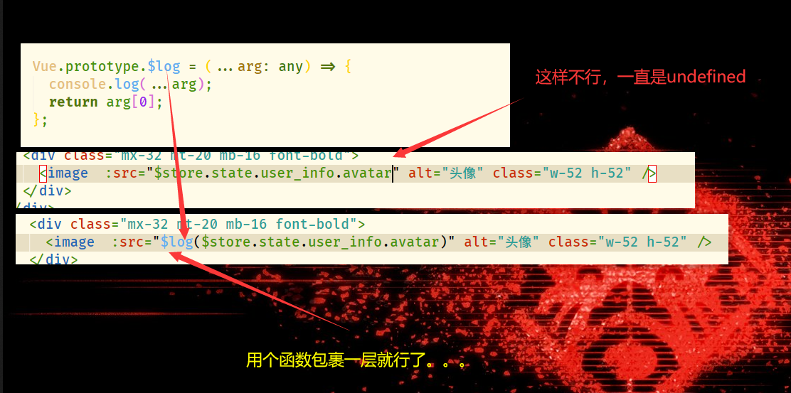

# uni-app 使用过程中的一些总的笔记

- pubdate:2019-12-27 09:22:49
- tags:uni,vue

---

## 语法

### 开启 optional-chaining

我是使用 uni-cli 构建的，所以开启 optional-chaining 语法只需要安装了@babel/plugin-proposal-optional-chaining 包后在项目下的 babel.config.js 中配置

```bash
const plugins = ["@babel/plugin-proposal-optional-chaining"];
```

就是在 plugins 中加上@babel/plugin-proposal-optional-chaining 就好了，但是有些玄学问题，昨天搞了半天这个语法都不能用各种报错，今天啥也没改重新开机就能用了。。。。

也就是说这样配置是没问题的，还报错就重启试试？

## 坑

### vuex \$store 无效



### img 标签表现不一致

之前用可以直接用 img 当时表现比 image 要更好可以自适应大小，结果最近用不了了.. 心态爆炸


{: id="20201104153359-zjxz9mz" type="doc"}
