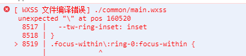
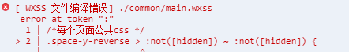

# 崮生的 uni-app 最佳实践
{: id="20210120134520-aeplf1b"}

[代码仓库](https://github.com/2234839/uni_app-demo)
{: id="20210120134603-09bte2u"}

## ((20201104153359-jkol7s4 "{{.text}}"))
{: id="20210120134541-yvifakc"}

！ 值得注意的是微信小程序并不支持一些 css 选择器还有他的 wxss 不支持 `\`  所以如果直接使用tailwindcss 会报错类似于图中这样的错 : 
{: id="20210120134556-w728bux"}

- {: id="20210120195129-c3dvtb9"}幸运的是 tailwindcss 支持自定义 [`separator`](https://tailwindcss.com/docs/configuration#separator)
- {: id="20210120195135-57ob4le"}但是在类名中包含 `.` 的又需要 `\.` 这样的形式去声明类名而且貌似没有办法自定义这个， 所以在这种情况下我复制了 `'tailwindcss/defaultConfig'` 中的配置将 `\` 全部改成了 `_`
- {: id="20210120201315-5n4a7qs"}这种语法 wxss 也不支持.... 这里不是 css 类名修改可以避免的，就只能去`corePlugins`禁用相关的插件
  - {: id="20210120201649-uhb7y2o"}禁用了 `space` `divideWidth` `divideStyle` `divideOpacity`
  {: id="20210120201649-ce03ndq"}
- {: id="20210120201713-360l9av"}本 demo 对 tailwind 进行了如上定制，所以在使用的时候需要注意这些点
  - {: id="20210120201917-92s9e1o"}建议使用这里 ((20210120201815-mhusgkv "{{.text}}")) 链接中的插件
  {: id="20210120201917-fjtzvap"}
{: id="20210120143301-jwaumns"}

{: id="20210120195121-s5hu63g"}

这个demo中采用的是[taro-tailwind](https://github.com/windedge/taro-tailwind/blob/master/tailwind.config.js) 的配置文件稍加修改后的, 关闭了几乎所有的响应式功能，但基础功能还是可以正常使用的
{: id="20210120144423-bcefv7s"}

{: id="20210120143702-htst9km"}

- {: id="20210120155741-provey6"}相关 commit 记录
  - {: id="20210120202255-stsczst"}引入 tailwindcss 并在 微信开发者工具中正常跑起来的改动 [`b3c7085`](https://github.com/2234839/uni_app-demo/commit/b3c70853540b90e896e0135bc829040413511e8e)
  - {: id="20210120202109-8jfxzry"}[🦄refactor(tailwind): 更好的配置文件](https://github.com/2234839/uni_app-demo/commit/e7c51502be6a9f5394cf8c83cd9a9bed4925411c)
  {: id="20210120202303-65ya0fp"}
{: id="20210120154930-d8l6wqa"}

---

{: id="20210120202722-mxsyfiy"}

## 文章分享到的地方：
{: id="20210120202722-w0313d3"}

- {: id="20210120202832-pd2mgfc"}((20210120134541-yvifakc "{{.text}}"))
  - {: id="20210120202841-qdj8dkh"}[dcloud](https://ask.dcloud.net.cn/article/38697)
  {: id="20210120202841-lwgaui2"}
{: id="20210120202827-1aaql58"}

{: id="20210120202802-rk4fhyb"}

{: id="20210120134520-egxkpts" type="doc"}
