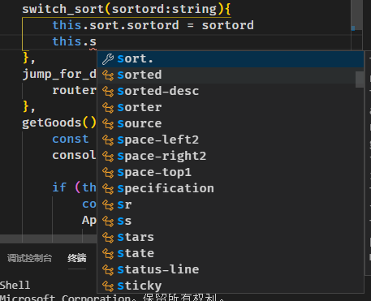

# vscode 使用心得

- pubdate:2019-08-03 10:15:28
- tags :vscode，心得，index

---

## 快捷键

### 选区

拓展性 (Shift + Alt + Right) 或者收缩性 (Shift + Alt + Left) 的选中文本

矩形框的鼠标选择： 同时按住 Shit 和 Alt 并使用鼠标进行拖拽选择

### 折叠与展开

折叠当前光标所在区域： Ctrl + Shift + [
取消当前光标所在区域的折叠： Ctrl + Shift + ]
折叠当前文件内容的所有区域： Ctrl + K Ctrl + 0

### 搜索

在 Ctrl+P 窗口下还可以

直接输入文件名，跳转到文件
? 列出当前可执行的动作
! 显示 Errors 或 Warnings，也可以 `Ctrl+Shift+M
: 跳转到行数，也可以 Ctrl+G 直接进入
@ 跳转到 symbol（搜索变量或者函数），也可以 Ctrl+Shift+O 直接进入
@:根据分类跳转 symbol，查找属性或函数，也可以 Ctrl+Shift+O 后输入：进入

## vscode 扩展插件

1. [change case](https://marketplace.visualstudio.com/items?itemName=wmaurer.change-case)
   这个插件可以执行各种命名规则
   我配置了这两个快捷键 
2. [alt+d 跳转](https://marketplace.visualstudio.com/items?itemName=jack89ita.open-file-from-path)
   vscode 在一些文件中 ctrl+click 并不能跳转一些路径，通过这个插件可以使用 alt+d 跳转

### 有问题的插件

HTML CSS Support 干扰智能提示

TabNine 导致完全没有其他的智能提示 ~~我写了一个插件来勉强解决这个问题 [suggest-plus](https://marketplace.visualstudio.com/items?itemName=llej.suggest-plus)~~ 。现在更推荐使用 [Code Autocomplete](https://marketplace.visualstudio.com/items?itemName=svipas.code-autocomplete) 他是 TabNine 的一个非官方实现，但有着同样的体验 ✨

### 曾经用过，但现在 我不推荐使用的插件

| 插件                                                                                                    | 不推荐理由                                                                         | 不推荐星 |
| --------------------------------------------------------------------------------------------------------- | --------------------------------------------------------------------------------------- | ------------ |
| [Code Autocomplete](https://marketplace.visualstudio.com/items?itemName=CoenraadS.bracket-pair-colorizer) | 过于花哨的括号实际并没有必要， 其实他的 scope line 功能还行 |               |

## 一些问题

[在一些文件中 tab 没有按照设定的宽度展示的问题](https://segmentfault.com/q/1010000008771415)
