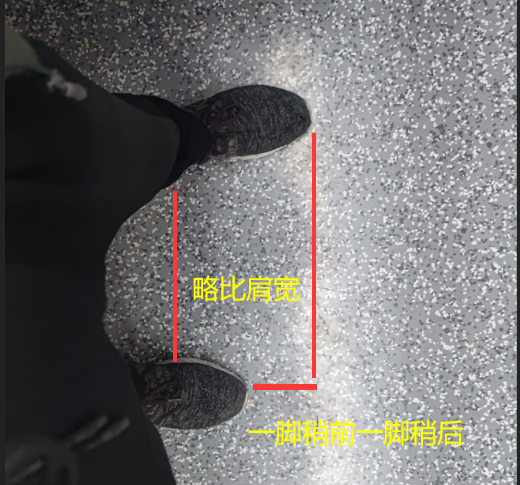

# 坐地铁无依靠站稳的技巧 咸蛋技巧

- pubdate:2020-10-15 13:45:09
- tags:咸蛋技巧

---

有什么用：无依靠，可以解放双手，无需依赖特定地形，更轻松

想要站稳需要先明白我们为什么站不稳，站不稳的原因主要是地铁加速与减速时惯性导致我们的身体朝有对应方向倾斜的趋势

所以我们需要身体朝着地铁前进方向的九十度方向，即车门方向，双腿分开略比肩宽一脚略前一脚略靠后，双腿分开让我们在加减速时有着很好的调节能力，一脚略前一脚略靠后使得即使转弯稍急也不至于身体前倾或者后倾

