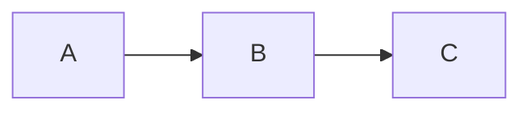

# 展开

- pubdate:2019-07-05 09:33:25
- tags:习题，javascript

---

题目：

联合使用 reduce 方法和 concat 方法，将一个数组的数组“展开”成一个单个数组，包含原始数组的所有元素。

```javascript
let arrays = [[1, 2, 3], [4, 5], [6]];
// Your code here.
// → [1, 2, 3, 4, 5, 6]
```

解：

````javascript
[[1, 2, 3], [4, 5], [6]].reduce((c,t)=>{
return c.concat(t)
})
````

```flow
//定义类型和描述
st=>start: 开始
e=>end: 结束
op=>operation: 我的操作
cond=>condition: 判断确认？

st->op->cond
cond(yes)->e
cond(no)->op

```




[toc]

@import "./字符计数.md"
