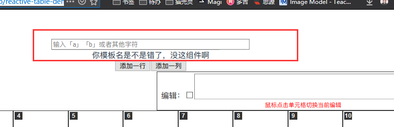
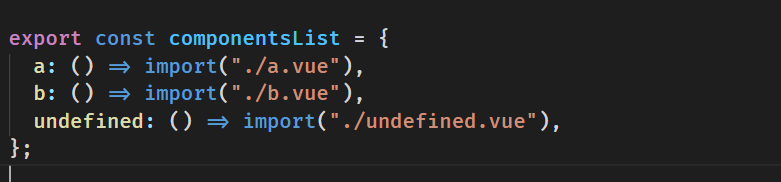
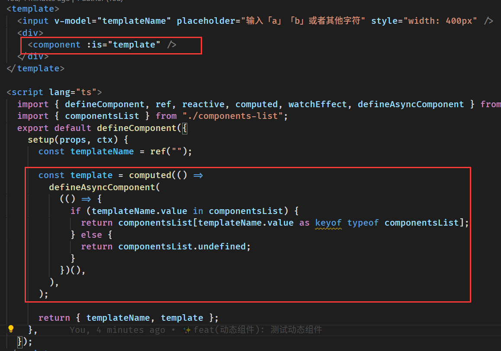

> [如何动态引入Vue组件？](https://www.zhihu.com/question/437966971)
> {: id="20210106142513-t5pr7r4"}
{: id="20210106142508-d0hfqsg"}

我第一时间想到的就是 `import`,
{: id="20210106142531-qqra541"}

刚上手实现了一遍，挺简单的。 [体验地址](https://2234839.github.io/vue-demo/)
{: id="20210106142549-p3kt4be"}

只注意红框内就好了，懒得新建项目了，在之前的测试项目上实现的
{: id="20210106142655-1c5g5v1"}

我的想法是先使用 `import()`建立一个组件表 
{: id="20210106142723-4l0qxr7"}

然后根据用户输入选择不同的组件 
{: id="20210106142800-37a2axb"}

没了....
{: id="20210106142918-g65j9da"}

就这么简单，我之前都想复杂了
{: id="20210106142921-f78d4z7"}

{: id="20210106142941-y7t63cv"}

{: id="20210106142508-wr3ob9l" type="doc"}
