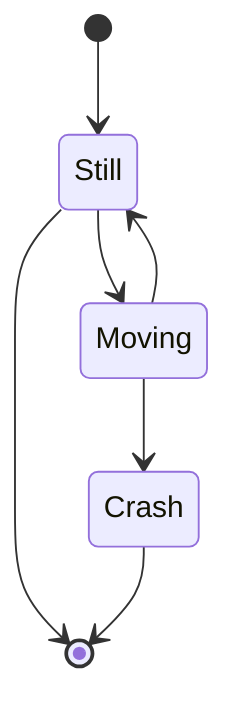

# markdown 学习

- pubdate: 2019-3-6 17:43
- tags : markdown

---

## [Markdown：语法](https://daringfireball.net/projects/markdown/syntax#philosophy)

```html{run}
<table>
  <tr>
    <td>markdown中也是可以使用html标签的.</td>
  </tr>
</table>
```

> 引用

```html
> 引用
```

### 列表

- Red
- Green
- Blue

```html
* Red * Green * Blue
```

[怎么使用代码画图](https://github.com/mermaid-js/mermaid)


