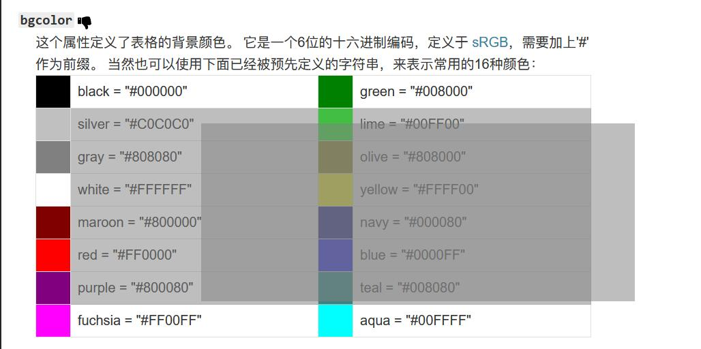

# 5 月

- pubdate:2020-05-05 09:01:13
- tags:每日总结

---

## 2020-5-4

1. [synaptic](https://github.com/cazala/synaptic) 这个 js 的神经网络库用起来挺简单的，训练他学习了异或

## 2020-5-9

1. [mask 遮罩使部分图片透明](https://www.zhangxinxu.com/wordpress/2020/05/css-mask-compress-png-image/)

## 2020-5-12

1. css border-radius 值语法的解析,主要是斜杠的用法 [border-radius](https://www.w3.org/TR/css-backgrounds-3/#border-radius)

   > The border-radius shorthand sets all four border-\*-radius properties. If values are given before and after the slash, then the values before the slash set the horizontal radius and the values after the slash set the vertical radius. If there is no slash, then the values set both radii equally. The four values for each radii are given in the order top-left, top-right, bottom-right, bottom-left. If bottom-left is omitted it is the same as top-right. If bottom-right is omitted it is the same as top-left. If top-right is omitted it is the same as top-left.

   > border-radius 简写设置所有四个 border-\*-radius 属性。如果在斜杠之前和之后都给出了值，那么斜杠之前的值设置水平半径，斜杠之后的值设置垂直半径。如果没有斜杠，则两个值相等地设置半径。每个半径的四个值按左上、右上、右下、左下的顺序给出。如果左下角省略了，它就和右上角一样。如果省略了右下角，它与左上角是一样的。如果省略了右上角，它与左上角是一样的。

   

   对于斜杠语法的理解：将斜杠之前和之后的看做两个部分按多值语法的规则补全，然后一一对应，前面的是水平方向的值后面的是垂直方向的值

## 2020-5-14

1.  vscode 报了好久的错

    Couldn't download IntelliCode model. Please check your network connectivity or firewall settings. Error Message: EPERM: operation not permitted, open

    之前尝试通过管理员打开 vscode 就没问题，其实从上面的报错也能看出是没权限写文件，但我一直不知道真正的解决方案，今天找到了。

    那就是修改 vscode "vsintellicode.modelDownloadPath" 配置项为可写的目录

    [参考资料](https://github.com/MicrosoftDocs/intellicode/issues/113)

2.  yapi 在 api 详情页中显示 修改列表

    效果 

    使用油猴脚本实现的 [脚本地址](https://greasyfork.org/zh-CN/scripts/392139-api%E8%87%AA%E5%8A%A8%E6%8F%90%E5%8F%96) 实现方式是监听页面变化，切换到详情页后调用 yapi 接口查询修改记录然后添加到详情页上

## 2020-5-18

1. js 通用拖拽多选工具函数 [ts 代码](https://www.typescriptlang.org/play?#code/GYVwdgxgLglg9mABINaNC-RoLE1CQCQCgJSIG8BYAKEXMQBsBTKRYSgQwHNEBeexygZ2oG5SFKrUSZAXMrtEAbQAMAGkTzFCmQF1EjbqLECyFCAm50AJjABuk43AggAttTBQAdBABO1RlGoBRGvcfYAESmZoG4ukIhTkYAnjQu3NwAKtQAHnQcAAYADnDcMLAIAFz0MKnUxnwARowQANbMrnDgxiWNjDF8cNm1BTElTgDMfJm6ghRWNv7OVXDGMU6M2dkOxgDCABYwlMbYIeHj5DR04oCX7oBG+pLiAPpQcNcX2OIHeuSTdg7OjMbG3mafABkYEYHNRXEFbM1eFYAO5gQIKbDUf6OfBsAB8hEOQkQBjA3Dg8UocGYEKhFTgcIRiGRnxeOIogDsEwCW-k53JD-ngIgzEDBgIgkSjnNBXJQANLUGL4YivHnkBgsSRQVwgfjYuXiWTqDi0xwuSgwT4ADW5cvImoAjNqaUL9YbHABNU1m3XObLuIUAEWowEYIEoUC5iAA9MHEIBuNMARtaADbzACXRgBkIwBccuqea7ondsgAFJo9ZieeBgIOhiORwDRcoA3uUASYqAQ5sU+QAL7Y+v0ibWD5676-IVAkFgMFkkC8DnUamCunsTEyuV8gUAQgVzGldZx7igIFcYGdQkbsqEmoATNa0xADcatxRNYMj7aT-aoE7l2dLhwbncHucnmIWwyorEiT6Mm0C4tUQABqRBAmyVJAnPN5zHTOJqCcDMrjEYCrTAiCoJg5dfygRCnBhGBjCgDZUOAw9EAAWiA84QPAyDoNgxA8IIjZqBgZgNkAp8pCvajaKkDCGOw51m2dd5pkWH4-kBYEvD7cFAkhQdqBAbJR1dNFJ2XGdsHnJhFyxXceVXddN2XHc5TxIxECgYxrgNWyOAAQVcVwOicYAmlsPY2ykgBHVVXBiABlagaGgOBXBcyhKCCeywnwTREAACSSABZAFfGoaYpFUZibJOQBaOSVBynOcYBti8cEkUobTEAuQAPt0AErlPwuBRUqgWxKBy6ZbnuR4ItwEbCsMQkkOJUknwUTBiqcWwlmwLqer6z4BvfXBZuK78cTmhalpW3q-HWt8LlwLzou8WoNmwFlpOMXahAXSRfR4NVZXE0gdzQLA8FIfCVka59pGDAAqMHEEAM91ACg5QAlyNSRAwbDMA7CqMEFHByHYbhmIkZRtGMZDCHEEAZ+V4cR5HEFR2x0dcTGSfJ3H8epwnXAK0gse0QAYlQuQAQtzEQBqJUACnVADi5aR5AwwBYOUAADlACztQB6Mxx-GAZiIHxEkKQabphRtaJvX6dZ2mwQ5khQEgQokCOtbHA2obKBKdKsptqBcBKC5jKEIrEHcaBJAipxmFoAAhZowFMMBmDWU9HAAJWoaAuWxMyN2kX3nBoYAoAUdPkO6HOE+cVxOO4gvoCcWYoDuWxTZ3c3oALYHWuwdOLXd84y6gfd26XWUzEYVwNGuWwYDAa5EY4VutWdfvB8YYfR+uPHJ8Li0hNNoRZ6HxbUnHyQp8PGeB+3xhd+Xn3V7403sS3qoF7HieL+gfdp5v4+75Hsfz-Tl+rSPweP6nz3ivZ+UhD5vwAcPIB39C4vyvGMWUKckDz0-nvAAPBwQBu9EYADIcEn2wYgdEmD757zwdvReeMMGICwUvRA5CUHQKISQ1BnRvqkFIPXS22g7YfnECUZ47dPYUD0pqNQRDtBgPUAAH2kZIjCmJLyqF7nKJB0gDyqFmmIK+WitS6KtBvCg9YaTvWEQyNR4gxLsJIKQMAjB7DcB6BAagiAWRmOEHQCqmt1ApSdtlE6jh8rOjSLkVwdAuGN07C3QuPd3Fe0MCYcwlh-KfBcO4TwPgAmBmCOYMIzFWLxAgIkFI6RJA5DyAUAsJQqrlEqDUeojQw6tEQO0To3Rej4QGMMUYuF4J-kmgBfehd6JYSYr0swCF4goRAVAdemFGI4RMnBCZ-TCLEVIkM6AUiBLpxGQs-JfT8LxHYiXQCuz+I0V2cJUZiy5QVScNkQct19j5JSXqWY8xFjLFWJsbYuwXlNmxCE6K4TwANwQBfYceA4kUHucAK6N1sB1QagHdkcBOSjWXF4jgQTAUkB3EAA)

   复制下面的代码到浏览器控制台执行，按住 ctrl 即可查看拖拽选中所有 td 元素的效果，修改其中的选择器即可实现拖拽选中任意想要可选中的元素

   ```javascript{run}
   "use strict";
   function 拖拽多选() {
     let flag = false;
     let 选区 = [0, 0, 0, 0];
     const div = document.createElement("div");
     div.style.cssText = `position: fixed;background: gray;opacity: .3;`;
     document.body.appendChild(div);
     let 选区矩形 = 选区_to_矩形(选区);
     document.addEventListener("mousedown", (event) => {
       console.log("mousedown", event);
       遮罩.remove();
       if (event.ctrlKey) {
         flag = true;
         选区[0] = event.clientX;
         选区[1] = event.clientY;
         event.preventDefault(); // 阻止默认行为
         event.stopPropagation(); // 阻止事件冒泡
       }
     });
     document.addEventListener("mousemove", (event) => {
       if (!flag) {
         return;
       }
       选区[2] = event.clientX;
       选区[3] = event.clientY;
       选区矩形 = 选区_to_矩形(选区);
       div.style.left = 选区矩形[0] + "px";
       div.style.top = 选区矩形[1] + "px";
       div.style.width = 选区矩形[2] - 选区矩形[0] + "px";
       div.style.height = 选区矩形[3] - 选区矩形[1] + "px";
     });
     document.addEventListener("mouseup", (event) => {
       if (!flag) {
         return;
       }
       const td_list = Array.from(document.querySelectorAll("td"));
       const 选中 = td_list.filter((el) => 矩形相交(选区矩形, HtmlElement_to_矩形(el)));
       console.log(选区矩形, 选中.map(HtmlElement_to_矩形), 选中);
       选中.map(HtmlElement_to_矩形).forEach(遮罩.add);
       flag = false;
     });
   }
   拖拽多选();
   function HtmlElement_to_矩形(el) {
     const rect = el.getBoundingClientRect();
     return [rect.left, rect.top, rect.right, rect.bottom];
   }
   function 矩形相交(rect1, rect2) {
     var a_min_x = rect1[0];
     var a_min_y = rect1[1];
     var a_max_x = rect1[2];
     var a_max_y = rect1[3];
     var b_min_x = rect2[0];
     var b_min_y = rect2[1];
     var b_max_x = rect2[2];
     var b_max_y = rect2[3];
     return a_min_x <= b_max_x && a_max_x >= b_min_x && a_min_y <= b_max_y && a_max_y >= b_min_y;
   }
   function 选区_to_矩形(选区) {
     if (选区[0] > 选区[2] || 选区[1] > 选区[3]) {
       return [选区[2], 选区[3], 选区[0], 选区[1]];
     } else {
       return 选区;
     }
   }
   var 遮罩;
   (function (遮罩) {
     let list = [];
     function add(rect) {
       const div = document.createElement("div");
       div.style.cssText = `position: fixed;background: gray;opacity: .3;`;
       div.style.left = rect[0] + "px";
       div.style.top = rect[1] + "px";
       div.style.width = rect[2] - rect[0] + "px";
       div.style.height = rect[3] - rect[1] + "px";
       list.push(div);
       document.body.appendChild(div);
     }
     遮罩.add = add;
     function remove() {
       list.forEach((el) => el.remove());
       list = [];
     }
     遮罩.remove = remove;
   })(遮罩 || (遮罩 = {}));
   ```

    如果是在 shenzilong.cn 站点查看本文章，可以按住 ctrl 在下面的表格拖拽尝试效果

   | 拖拽 | 多选 | 测试 |
   | ---- | ---- | ---- |
   | 1    | 2    | 7    |
   | 3    | 4    | 8    |
   | 5    | 6    | 9    |

## 2020-5-18

1.  [elementFromPoint](https://developer.mozilla.org/zh-CN/docs/Web/API/Document/elementFromPoint) 这个 dom api 可以返回当前文档上处于指定坐标位置最顶层的元素

2.  利用 [elementFromPoint](https://developer.mozilla.org/zh-CN/docs/Web/API/Document/elementFromPoint) 写了一个 [去除顶部遮挡](https://greasyfork.org/zh-CN/scripts/403713-%E5%8E%BB%E9%99%A4%E9%A1%B6%E9%83%A8%E9%81%AE%E6%8C%A1) 的油猴脚本


    写这个脚本的缘由是因为 「容易吗我」发起的[脚本创建请求](https://greasyfork.org/zh-CN/forum/discussion/78198/求个脚本-阻止网页元素顶部滞留#latest)

    下面是他的论点，我也曾有过相同的感觉

    > 不知道什么风刮的，现在很多网页都存有顶部滞留一大横条、占用有限的可视空间的问题。 比如搜索引擎，其实一旦用户输入了搜索词后，焦点已不再是搜索框了，还占着顶部空间有意义吗？ 求大神出个脚本，解除顶部冻结，让它随网页滚一边去。

    核心思想是利用 elementFromPoint 找到顶部元素，然后大致的判断一下它会不会是顶部的遮挡屋，是的话就隐藏起来

    [Todo]这里我感觉自己的判断不太好，但暂时也没想起来怎么做个更好的。有兴趣的可以 [去这里查看源码](https://github.com/2234839/userJS/blob/master/去除顶部遮挡/去除顶部遮挡.user.ts) 指点一下我

    **效果** :

    有顶部遮挡  无顶部遮挡 
