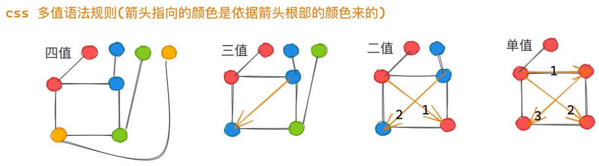

# 五月

- pubdate:2020-05-05 09:01:13
- tags:每日总结

---

## 2020-5-4

1. [synaptic](https://github.com/cazala/synaptic) 这个 js 的神经网络库用起来挺简单的，训练他学习了异或

## 2020-5-9

1. [mask 遮罩使部分图片透明](https://www.zhangxinxu.com/wordpress/2020/05/css-mask-compress-png-image/)

## 2020-5-12

1. css border-radius 值语法的解析,主要是斜杠的用法 [border-radius](https://www.w3.org/TR/css-backgrounds-3/#border-radius)

   > The border-radius shorthand sets all four border-\*-radius properties. If values are given before and after the slash, then the values before the slash set the horizontal radius and the values after the slash set the vertical radius. If there is no slash, then the values set both radii equally. The four values for each radii are given in the order top-left, top-right, bottom-right, bottom-left. If bottom-left is omitted it is the same as top-right. If bottom-right is omitted it is the same as top-left. If top-right is omitted it is the same as top-left.

   > border-radius 简写设置所有四个 border-\*-radius 属性。如果在斜杠之前和之后都给出了值，那么斜杠之前的值设置水平半径，斜杠之后的值设置垂直半径。如果没有斜杠，则两个值相等地设置半径。每个半径的四个值按左上、右上、右下、左下的顺序给出。如果左下角省略了，它就和右上角一样。如果省略了右下角，它与左上角是一样的。如果省略了右上角，它与左上角是一样的。

   

   对于斜杠语法的理解：将斜杠之前和之后的看做两个部分按多值语法的规则补全，然后一一对应，前面的是水平方向的值后面的是垂直方向的值
